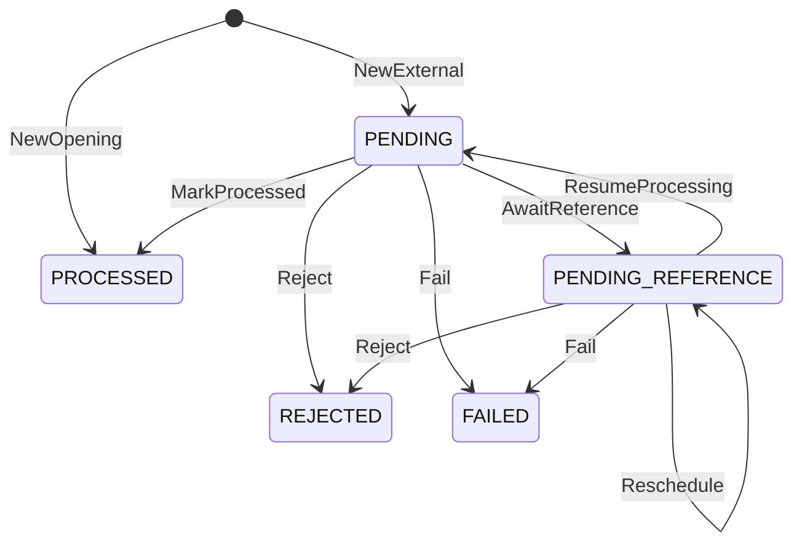

# Arquitetura

## Money

Valores monetários são `int64` em minor units (centavos) mais um código ISO 4217. Só moedas
com duas casas decimais são aceitas: BRL, USD e EUR. O intervalo vai até
±92.233.720.368.547.758,07, muito além de qualquer wallet. Nenhum caminho usa `float`.

Contrato externo:
- O `amount` é sempre uma string JSON no formato `^(0|[1-9]\d*)\.\d{2}$`, e a `currency`
  é o código em maiúsculas: `{"amount":"25.00","currency":"BRL"}`.
- Os valores abaixo são rejeitados, nunca arredondados:
  - `25.00` como número JSON;
  - `"25"`, `"1.5"`, `"01.00"`, `"+1.00"` e `"1e2"`;
  - espaços;
  - valores negativos.
- Como o formato é estrito, cada valor tem uma única representação textual, e o hash do
  payload não precisa normalizar amounts.

Internamente:
- O parse acumula dígito a dígito com checagem de overflow. `strconv.ParseFloat` nunca é
  usado.
- `ParseSigned` aceita um `-` inicial para valores internos (por exemplo, a soma do ledger
  na reconciliação) e rejeita `-0.00`.
- `Add`, `Sub` e `Neg` retornam `ErrOverflow` em vez de dar a volta. Operações entre moedas
  diferentes retornam `ErrCurrencyMismatch`.
- O zero value de `Money` é inválido: todo método retorna `ErrUninitialized`, então um valor
  esquecido nunca vira `0.00` em silêncio.
- Erros de parse são `*ParseError{Input, Reason}`. O `Reason` é um dos sentinels
  (`ErrInvalidAmount`, `ErrInvalidCurrency`, `ErrOverflow`, `ErrInvalidJSON`) e funciona com
  `errors.Is` e `errors.As`.

## Acesso ao banco e mapeamento de Money

- Driver: pgx v5 com `pgxpool`. As queries são SQL escrito à mão, com parâmetros
  posicionais (`$1`), e o sqlc (v1.31.1) as compila em funções Go tipadas, validando cada
  query contra o schema das migrations. Não há ORM.
- O código gerado fica versionado em `internal/adapters/postgres/database`. O CI roda
  `sqlc diff` e falha se ele divergir das queries.
- Migrations com goose, em SQL, embutidas no binário `migrate` (`up`, `down`, `status`,
  `reset`). Toda migration tem `Down`, e os grants do papel da aplicação vivem nas próprias
  migrations.
- `Money` vira duas colunas: `*_minor BIGINT` com as unidades mínimas e `currency CHAR(3)`.
  O valor é gravado e lido exatamente como o `int64` do domínio, sem `NUMERIC` nem `float`.
- Dois papéis no Postgres:
  - `wallet_migrator` é dono do banco e do schema e roda as migrations;
  - `wallet_app` só tem `SELECT`/`INSERT`/`UPDATE` nas tabelas de que precisa, e não pode
    alterar schema, desligar triggers nem apagar linhas.

## Invariantes no banco

As invariantes financeiras valem mesmo que o código da aplicação erre. Cada uma tem um nome
de constraint estável, que a aplicação usa para classificar o erro.

- Saldo nunca negativo: `CHECK (balance_minor >= 0)` na carteira e nos saldos do ledger.
- Todo saldo alterado tem lançamento:
  - uma constraint trigger adiada (`wallets_ledger_coupling`) roda no commit. Se o saldo
    mudou, exige `version = anterior + 1` e um lançamento com
    `(wallet_id, wallet_version, saldo anterior, saldo posterior)` iguais;
  - se o saldo não mudou, a versão também não pode mudar;
  - uma segunda trigger (`ledger_entries_wallet_coupling`) impede lançamento à frente da
    versão da carteira;
  - com `UNIQUE (wallet_id, wallet_version)`, lançamentos e mudanças de saldo ficam em
    correspondência um para um.
- Lançamento coerente:
  - aritmética `after = before ± amount` por direção;
  - `amount > 0`, então `LOSS` nunca gera lançamento;
  - chaves estrangeiras compostas obrigam o lançamento a ter a moeda da carteira e a
    carteira, a moeda e o valor da sua transação.
- Ledger append-only: `UPDATE`, `DELETE` e `TRUNCATE` são revogados do papel da aplicação,
  e triggers os recusam até para o dono da tabela.
- Sem movimentação duplicada:
  - `UNIQUE (wallet_id, transaction_id)` no ledger;
  - `UNIQUE (provider_id, idempotency_key)` e `UNIQUE (provider_id,
    external_transaction_id)` nas transações;
  - no máximo um `OPENING` por carteira;
  - no máximo uma reversão processada por transação referenciada.
- Transação terminal congelada: uma trigger recusa qualquer alteração depois de `PROCESSED`,
  `REJECTED` ou `FAILED`. Identidade, valor, hash e referência externa são imutáveis em
  qualquer estado, e a referência resolvida só pode ser gravada uma vez.
- `PENDING` nunca é gravado: o `CHECK` de status só aceita `PENDING_REFERENCE` e os estados
  terminais.
- Origem: `INTERNAL` se e somente se `OPENING`, sem nenhum metadado externo. Operações
  externas exigem provider existente, ids e chave no formato do contrato e hash SHA-256 em
  hex.
- Outbox: o envelope gravado (id, tipo, versão, agregado, payload, horários) é imutável; só
  as colunas de entrega mudam.
- Carteira: id, jogador, moeda e criação são imutáveis, e carteiras não são apagadas.

## Fronteira da transação

## Idempotência

HTTP e SQS montam o mesmo comando. O corpo do `POST /wagering/transactions` e o `data` da
mensagem `WagerTransactionRequested` são o mesmo contrato; o SQS só acrescenta
`idempotencyKey`, que no HTTP vem do header `Idempotency-Key`. O servidor nunca troca a chave
recebida por uma calculada.

Hash do payload:
- SHA-256, em hex minúsculo, do JSON canônico dos campos de negócio: `providerId`,
  `externalTransactionId`, `playerId`, `walletId`, `roundId`, `gameId`, `kind`,
  `money{amount,currency}` e, só quando presente, `referenceExternalTransactionId`.
- Ficam de fora a chave de idempotência, o `messageId`, o `occurredAt`, o tipo do envelope,
  headers e claims do token. Por isso a mesma operação tem o mesmo hash nos dois canais, e um
  teste compara o corpo HTTP e a mensagem SQS do enunciado.
- JSON canônico: chaves em ordem lexicográfica de bytes, sem espaços, sem escape de HTML e sem
  quebra de linha no final.
- A única normalização é renderizar os UUIDs no formato canônico em minúsculas. Os demais
  formatos são estritos e não têm duas grafias para o mesmo valor:
  - valor com exatamente duas casas decimais;
  - moeda e `kind` em maiúsculas;
  - identificadores em ASCII visível.

Formato dos campos, validado antes das regras de negócio:
- Identificadores (`providerId`, `externalTransactionId`, `roundId`, `gameId`,
  `referenceExternalTransactionId`), a chave de idempotência e o correlation id têm de 1 a
  128 caracteres ASCII visíveis (0x21–0x7E). Espaço não é aceito: o HTTP remove espaços das
  pontas de um header e o SQS não, então a mesma chave poderia chegar diferente por canal.
- UUIDs só no formato de 36 caracteres com hífens, em maiúsculas ou minúsculas. O UUID nulo é
  rejeitado.
- Todos os erros de formato voltam juntos, um por campo. Só depois vêm as regras do domínio:
  `OPENING` proibido, política de valor zero e presença da referência.

## Locking e concorrência

## Máquina de estados

- `PENDING` só existe em memória. Uma operação síncrona vai de `PENDING` para `PROCESSED`,
  `REJECTED` ou `PENDING_REFERENCE` dentro de uma única transação SQL, e `Rehydrate` recusa
  um snapshot em `PENDING`.
- `PENDING_REFERENCE` é o único estado não terminal gravado no banco. O resolver de qualquer
  instância o retoma.
- `PROCESSED`, `REJECTED` e `FAILED` são terminais: toda transição a partir deles retorna
  `ErrTerminalState`. Uma transição fora do diagrama retorna `ErrInvalidTransition`.
- O replay lê o resultado persistido e nunca chama as regras de novo.
- `Rehydrate` valida o snapshot sem reaplicar transições, lançamentos ou eventos.
- Todas as regras de negócio ficam em `wager.Rules.Apply`. HTTP, SQS e o resolver chamam essa
  mesma função.

## Falhas transitórias vs permanentes

- Transitórias: erro de conexão, SQLSTATE `08*`/`57P0*`/`53300`, `40001`, `40P01`, `55P03`,
  deadline do contexto, 5xx ou throttling do SQS. São repetidas e nunca persistidas.
- Permanentes: violação de integridade inesperada, estado gravado corrompido (um `Rehydrate`
  que falha) ou retries transitórios esgotados no resolver. A transação vai para `FAILED`
  com `PROCESSING_FAILED`, para auditoria.
- Rejeição de negócio não é falha: a transação termina em `REJECTED` com um `failureCode`.

## Referências pendentes

- A referência é resolvida por `(providerId, referenceExternalTransactionId)`. `REFUND` e
  `ROLLBACK` exigem uma; `WIN` pode informar uma `BET`.
- Referência ausente, ou presente mas ainda não terminal, deixa a transação em
  `PENDING_REFERENCE`. A primeira espera grava o deadline (`agora + TTL`) e emite
  `WagerTransactionPendingReference`. As tentativas seguintes só reagendam, sem evento.
- `attempts` conta toda busca que não encontrou uma referência utilizável, inclusive a
  síncrona. O próximo instante é `agora + backoff(attempts)`, limitado ao deadline.
- Quando `attempts` chega ao máximo ou o deadline passa, a transação vira `REJECTED`, com
  `REFERENCE_NOT_FOUND` se a referência nunca apareceu, ou `REFERENCE_NOT_SETTLED` se ela
  existe mas não terminou. O evento `WagerTransactionRejected` é emitido.
- Uma referência que terminou sem sucesso (`REJECTED` ou `FAILED`) rejeita a transação na
  hora, com `REFERENCE_NOT_PROCESSED`.
- Tipo, provider, jogador, carteira, rodada, moeda e valor da referência nunca mudam, então
  são checados antes do status. Uma referência que nunca vai servir é rejeitada na hora, sem
  esperar o TTL.

## Política de reversão

- Cada transação referenciada recebe no máximo uma reversão processada, de qualquer tipo.
  Uma `BET` é reembolsada **ou** desfeita, nunca as duas coisas.
- Um `REFUND` pode ser desfeito uma vez (`ROLLBACK` do `REFUND`). Depois disso a `BET` não
  pode ser reembolsada de novo, porque já tem uma reversão processada. Assim o mesmo débito
  nunca é devolvido duas vezes.
- `REFUND` só referencia `BET`. `ROLLBACK` referencia `BET`, `WIN` ou `REFUND`; `ROLLBACK`
  de `ROLLBACK`, `LOSS` ou `OPENING` retorna `REFERENCE_KIND_NOT_REVERSIBLE`.
- O valor da reversão é igual ao da referência, porque reversões parciais estão fora do
  escopo. Um valor diferente retorna `REFERENCE_AMOUNT_MISMATCH`.
- Um `ROLLBACK` que precisaria debitar mais que o saldo é rejeitado com
  `REVERSAL_INSUFFICIENT_FUNDS`, diferente do `INSUFFICIENT_FUNDS` de uma aposta.
- O domínio recebe a informação "já revertida" junto com a referência. Um índice único
  parcial no banco garante a mesma regra.

## Códigos de falha

"Corrigível" quer dizer que a requisição estava errada: o provider pode corrigi-la e reenviar
com um novo `externalTransactionId` e uma nova chave, já que a transação rejeitada é
terminal. "Definitivo" quer dizer que a requisição era coerente e a resposta é não.

| Código | Quando | Tipo |
|---|---|---|
| `WALLET_NOT_FOUND` | A carteira não existe | Corrigível |
| `WALLET_PLAYER_MISMATCH` | A carteira é de outro jogador | Corrigível |
| `CURRENCY_MISMATCH` | A moeda difere da moeda da carteira | Corrigível |
| `REFERENCE_NOT_FOUND` | A referência não apareceu até o TTL ou o limite de tentativas | Corrigível |
| `REFERENCE_MISMATCH` | A referência difere em provider, jogador, carteira, rodada ou moeda, ou o `WIN` não referencia uma `BET` | Corrigível |
| `REFERENCE_KIND_NOT_REVERSIBLE` | O tipo da referência não pode ser revertido por esta operação | Corrigível |
| `REFERENCE_AMOUNT_MISMATCH` | O valor da reversão difere do valor referenciado | Corrigível |
| `INSUFFICIENT_FUNDS` | A `BET` excede o saldo | Definitivo |
| `REVERSAL_INSUFFICIENT_FUNDS` | O `ROLLBACK` debitaria mais que o saldo | Definitivo |
| `REFERENCE_NOT_SETTLED` | A referência existe, mas não terminou até o TTL ou o limite de tentativas | Definitivo |
| `REFERENCE_NOT_PROCESSED` | A referência terminou em `REJECTED` ou `FAILED` | Definitivo |
| `ALREADY_REVERSED` | A referência já tem uma reversão processada | Definitivo |
| `BALANCE_OVERFLOW` | O crédito passaria do maior saldo representável | Definitivo |
| `PROCESSING_FAILED` | Falha permanente de infraestrutura (estado `FAILED`) | Definitivo |

Quando mais de uma regra falha, vale a primeira nesta ordem: carteira (existência, jogador,
moeda), referência (tipo, identidade, valor, status, reversão anterior) e, por último, o
efeito no saldo. As rejeições de carteira não devolvem saldo, para não expor o saldo de
outro jogador. As demais guardam o saldo observado na rejeição, e o replay o devolve.

## Inbox e outbox

## Contratos SQS

## Contratos e roteamento de eventos

Envelope de todo evento:

| Campo | Conteúdo |
|---|---|
| `eventId` | UUIDv5 de `(transactionId, eventType)` |
| `eventType` | `WagerTransactionProcessed`, `WagerTransactionRejected`, `WagerTransactionPendingReference` ou `WalletBalanceChanged` |
| `aggregateId` | `transactionId` nos eventos de transação; `walletId` em `WalletBalanceChanged` |
| `correlationId` | O da requisição que criou a transação |
| `causationId` | Só em `WalletBalanceChanged`: o `transactionId` que moveu o saldo |
| `occurredAt` | UTC, RFC 3339 |
| `version` | `1` em todos os tipos, definido pelo construtor |
| `data` | Payload tipado do evento |

- Cada transação emite cada tipo de evento no máximo uma vez, então o `eventId` é
  determinístico. Uma republicação carrega o mesmo `eventId`, e a chave primária da outbox
  impede que o mesmo evento seja gravado duas vezes.
- Valores monetários seguem o contrato de `Money`: `{"amount":"25.00","currency":"BRL"}`.
- Os eventos de `OPENING` têm `origin: "INTERNAL"` e omitem provider, ids externos, rodada e
  jogo.
- `WalletBalanceChanged` traz `walletId`, `transactionId`, `direction`, `money`,
  `balanceBefore`, `balanceAfter` e `walletVersion`. Consumidores ordenam por
  `walletVersion`.
- A chave de partição de todo evento é o `walletId`.

## Identity provider e validação de token

## Modelo de permissões

## Controle de acesso ao broker

`deploy/aws/provision.sh` cria as filas e um usuário IAM por papel, cada um com uma policy
restrita às filas de que precisa:

| Usuário | Permissões |
|---|---|
| `provider-producer` | `SendMessage` em `wager-transactions.fifo` |
| `wallet-service` | Receber, apagar e mudar visibilidade em `wager-transactions.fifo`; enviar para `wager-transactions-dlq.fifo` e `wallet-events.fifo` |
| `events-reader` | Receber, apagar e mudar visibilidade em `wallet-events.fifo` |

Todas as filas são FIFO, com `ContentBasedDeduplication=false` e `VisibilityTimeout=30`:
- `wager-transactions.fifo` faz long polling de 20 s e manda a mensagem para
  `wager-transactions-dlq.fifo` depois de 10 recebimentos;
- `wallet-events.fifo` usa a mesma regra de 10 recebimentos, com `wallet-events-dlq.fifo`;
- as DLQs guardam mensagens por 14 dias.

O script é idempotente e pode rodar de novo a qualquer momento.

## Emulador AWS local

SQS e IAM locais rodam no [MiniStack](https://github.com/ministackorg/ministack), fixado em
`ministackorg/ministack:1.5.17`. Ele é gratuito e sobe a partir de um clone limpo, sem conta
nem token.

Três candidatos foram testados com a AWS CLI em 2026-09-26:

| | LocalStack 2026.8.4 | LocalStack 4.14.0 | MiniStack 1.5.17 |
|---|---|---|---|
| Sobe sem conta ou auth token | Não, sai com código 55 (license activation failed) | Sim | Sim |
| Filas FIFO, `MessageDeduplicationId`, redrive para DLQ FIFO | Não testável sem token | Sim | Sim |
| Policies IAM aplicadas | Recurso pago | Não, `ENFORCE_IAM=1` é ignorado | Não |
| `SenderId` distingue credenciais | Não testável sem token | Não, `000000000000` para toda chave | Não, `000000000000` para toda chave |

O LocalStack 4.14.0 é a última imagem que roda sem token. O repositório da edição community
foi arquivado em 2026-03-23, então ele não recebe mais correções. O MiniStack tem licença MIT
e continua recebendo releases.

Nos dois candidatos que subiram, os comportamentos do SQS dos quais o consumer depende
bateram com a AWS:
- Um envio sem deduplication id é rejeitado quando `ContentBasedDeduplication=false`.
- Um deduplication id repetido devolve o `MessageId` original e a mensagem é entregue uma
  única vez.
- Enquanto um message group tem uma mensagem in flight, nenhuma outra mensagem desse grupo é
  entregue.
- `ChangeMessageVisibility=0` libera a mensagem na hora e incrementa `ApproximateReceiveCount`.
- Depois de `maxReceiveCount` recebimentos, a mensagem vai para a DLQ FIFO.

## Módulos Fx e sequência de shutdown

## Observabilidade

## Limitações, interpretações e trabalho pendente

- O IAM não é aplicado localmente. Os usuários e policies por papel continuam sendo
  provisionados, e só são aplicados na AWS real.
- Localmente, o `SenderId` é o account id para qualquer credencial, então o consumer não o usa
  para identificar o provider. O provider do envelope é validado contra o banco.
- `BET` e `LOSS` não aceitam `referenceExternalTransactionId`, e nenhuma operação pode
  referenciar a si mesma. As duas situações são entrada inválida.
- A referência de um `WIN` é opcional e não tem regra de valor: um prêmio não precisa ser
  igual à aposta.
