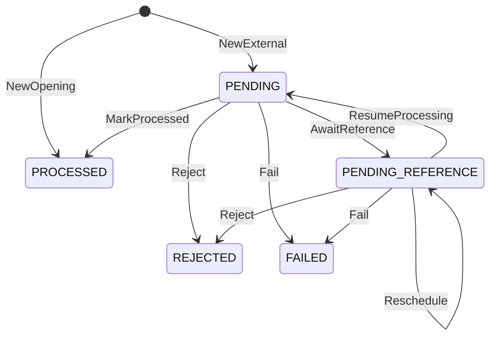

# Arquitetura

## Money

Valores monetários são `int64` em minor units (centavos) mais um código ISO 4217. Só moedas
com duas casas decimais são aceitas: BRL, USD e EUR. O intervalo vai até
±92.233.720.368.547.758,07, muito além de qualquer wallet. Nenhum caminho usa `float`.

Contrato externo:
- O `amount` é sempre uma string JSON no formato `^(0|[1-9]\d*)\.\d{2}$`, e a `currency`
  é o código em maiúsculas: `{"amount":"25.00","currency":"BRL"}`.
- Os valores abaixo são rejeitados, nunca arredondados:
  - `25.00` como número JSON;
  - `"25"`, `"1.5"`, `"01.00"`, `"+1.00"` e `"1e2"`;
  - espaços;
  - valores negativos.
- Como o formato é estrito, cada valor tem uma única representação textual, e o hash do
  payload não precisa normalizar amounts.

Internamente:
- O parse acumula dígito a dígito com checagem de overflow. `strconv.ParseFloat` nunca é
  usado.
- `ParseSigned` aceita um `-` inicial para valores internos (por exemplo, a soma do ledger
  na reconciliação) e rejeita `-0.00`.
- `Add`, `Sub` e `Neg` retornam `ErrOverflow` em vez de dar a volta. Operações entre moedas
  diferentes retornam `ErrCurrencyMismatch`.
- O zero value de `Money` é inválido: todo método retorna `ErrUninitialized`, então um valor
  esquecido nunca vira `0.00` em silêncio.
- Erros de parse são `*ParseError{Input, Reason}`. O `Reason` é um dos sentinels
  (`ErrInvalidAmount`, `ErrInvalidCurrency`, `ErrOverflow`, `ErrInvalidJSON`) e funciona com
  `errors.Is` e `errors.As`.

## Acesso ao banco e mapeamento de Money

- Driver: pgx v5 com `pgxpool`. As queries são SQL escrito à mão, com parâmetros
  posicionais (`$1`), e o sqlc (v1.31.1) as compila em funções Go tipadas, validando cada
  query contra o schema das migrations. Não há ORM.
- O código gerado fica versionado em `internal/adapters/postgres/database`. O CI roda
  `sqlc diff` e falha se ele divergir das queries.
- Migrations com goose, em SQL, embutidas no binário `migrate` (`up`, `down`, `status`,
  `reset`). Toda migration tem `Down`, e os grants do papel da aplicação vivem nas próprias
  migrations.
- `Money` vira duas colunas: `*_minor BIGINT` com as unidades mínimas e `currency CHAR(3)`.
  O valor é gravado e lido exatamente como o `int64` do domínio, sem `NUMERIC` nem `float`.
- Dois papéis no Postgres:
  - `wallet_migrator` é dono do banco e do schema e roda as migrations;
  - `wallet_app` só tem `SELECT`/`INSERT`/`UPDATE` nas tabelas de que precisa, e não pode
    alterar schema, desligar triggers nem apagar linhas.

## Invariantes no banco

As invariantes financeiras valem mesmo que o código da aplicação erre. Cada uma tem um nome
de constraint estável, que a aplicação usa para classificar o erro.

- Saldo nunca negativo: `CHECK (balance_minor >= 0)` na carteira e nos saldos do ledger.
- Todo saldo alterado tem lançamento:
  - uma constraint trigger adiada (`wallets_ledger_coupling`) roda no commit. Se o saldo
    mudou, exige `version = anterior + 1` e um lançamento com
    `(wallet_id, wallet_version, saldo anterior, saldo posterior)` iguais;
  - se o saldo não mudou, a versão também não pode mudar;
  - uma segunda trigger (`ledger_entries_wallet_coupling`) impede lançamento à frente da
    versão da carteira;
  - com `UNIQUE (wallet_id, wallet_version)`, lançamentos e mudanças de saldo ficam em
    correspondência um para um.
- Lançamento coerente:
  - aritmética `after = before ± amount` por direção;
  - `amount > 0`, então `LOSS` nunca gera lançamento;
  - chaves estrangeiras compostas obrigam o lançamento a ter a moeda da carteira e a
    carteira, a moeda e o valor da sua transação.
- Partidas dobradas (ver [Ledger de partidas dobradas](#ledger-de-partidas-dobradas)):
  - toda movimentação grava um journal em `ledger_postings`, e uma constraint trigger adiada
    confere no commit que os débitos do journal são iguais aos créditos;
  - o journal só existe para transação `PROCESSED`. Ele espelha o lançamento da carteira na
    conta `PLAYER_BALANCES`, contra `FUNDING` na abertura e `GAMING_REVENUE` nas operações
    externas;
  - lançamento sem journal e journal sem lançamento são recusados, e uma chave estrangeira
    composta obriga cada partida a ter o valor e a moeda da sua transação.
- Ledger append-only: `UPDATE`, `DELETE` e `TRUNCATE` são revogados do papel da aplicação,
  e triggers os recusam até para o dono da tabela. Vale para `ledger_entries` e para
  `ledger_postings`.
- Sem movimentação duplicada:
  - `UNIQUE (wallet_id, transaction_id)` no ledger;
  - `UNIQUE (provider_id, idempotency_key)` e `UNIQUE (provider_id,
    external_transaction_id)` nas transações;
  - no máximo um `OPENING` por carteira;
  - no máximo uma reversão processada por transação referenciada.
- Transação terminal congelada: uma trigger recusa qualquer alteração depois de `PROCESSED`,
  `REJECTED` ou `FAILED`. Identidade, valor, hash e referência externa são imutáveis em
  qualquer estado, e a referência resolvida só pode ser gravada uma vez.
- `PENDING` nunca é gravado: o `CHECK` de status só aceita `PENDING_REFERENCE` e os estados
  terminais.
- Origem: `INTERNAL` se e somente se `OPENING`, sem nenhum metadado externo. Operações
  externas exigem provider existente, ids e chave no formato do contrato e hash SHA-256 em
  hex.
- Outbox: o envelope gravado (id, tipo, versão, agregado, payload, horários) é imutável; só
  as colunas de entrega mudam.
- Carteira: id, jogador, moeda e criação são imutáveis, e carteiras não são apagadas.

## Fronteira da transação

- Os casos de uso são donos da transação, e os repositórios nunca abrem uma.
  `TxRunner.InTx(ctx, fn)` abre a transação em `READ COMMITTED` e chama `fn` com um `Store`.
  Os repositórios do `Store` (`Wallets`, `Transactions`, `Ledger`, `Outbox`, `Inbox`) usam
  todos a mesma `pgx.Tx`. Se `fn` retornar `nil`, o runner faz o commit; qualquer erro faz
  rollback.
- O `Store` é o único acesso ao banco dentro da transação. Por isso "tudo no mesmo commit"
  aparece na própria chamada: carteira, transação, lançamento, journal, outbox e inbox.
- Toda transação define `lock_timeout` e `statement_timeout` com `SET LOCAL`, no mesmo round
  trip do `BEGIN`. Nada vaza para o próximo uso da conexão.
  `idle_in_transaction_session_timeout` fica configurado no papel `wallet_app`.
- `InTx` repete a transação inteira, com limite e backoff exponencial com jitter, em dois
  casos:
  - serialization failure, deadlock e lock timeout;
  - `23505` nos índices de chave de idempotência, id externo e reversão. Isso é uma corrida
    perdida, e a nova execução encontra a vencedora.

  Por isso `fn` precisa poder rodar de novo: ela relê tudo pelo `Store`.
- Erros de conexão não são repetidos dentro de `InTx`, porque um `COMMIT` perdido tem
  resultado desconhecido. Quem chamou tenta de novo (HTTP 503, visibilidade do SQS, próximo
  ciclo do resolver), e a idempotência absorve a repetição.
- `InReadOnlySnapshot` usa `REPEATABLE READ READ ONLY`. Todas as leituras da reconciliação
  veem o mesmo instante, e qualquer escrita é recusada.
- Os repositórios recebem e devolvem agregados do domínio. Gravam `Snapshot()` e leem com
  `Rehydrate`. Uma linha que não passa na validação do domínio é tratada como estado
  corrompido, uma falha permanente.
- Nenhuma query usa `now()`: todo horário vem do relógio da aplicação, como no domínio.

## Idempotência

HTTP e SQS montam o mesmo comando. O corpo do `POST /wagering/transactions` e o `data` da
mensagem `WagerTransactionRequested` são o mesmo contrato; o SQS só acrescenta
`idempotencyKey`, que no HTTP vem do header `Idempotency-Key`. O servidor nunca troca a chave
recebida por uma calculada.

Hash do payload:
- SHA-256, em hex minúsculo, do JSON canônico dos campos de negócio: `providerId`,
  `externalTransactionId`, `playerId`, `walletId`, `roundId`, `gameId`, `kind`,
  `money{amount,currency}` e, só quando presente, `referenceExternalTransactionId`.
- Ficam de fora a chave de idempotência, o `messageId`, o `occurredAt`, o tipo do envelope,
  headers e claims do token. Por isso a mesma operação tem o mesmo hash nos dois canais, e um
  teste compara o corpo HTTP e a mensagem SQS do enunciado.
- JSON canônico: chaves em ordem lexicográfica de bytes, sem espaços, sem escape de HTML e sem
  quebra de linha no final.
- A única normalização é renderizar os UUIDs no formato canônico em minúsculas. Os demais
  formatos são estritos e não têm duas grafias para o mesmo valor:
  - valor com exatamente duas casas decimais;
  - moeda e `kind` em maiúsculas;
  - identificadores em ASCII visível.

Formato dos campos, validado antes das regras de negócio:
- Identificadores (`providerId`, `externalTransactionId`, `roundId`, `gameId`,
  `referenceExternalTransactionId`), a chave de idempotência e o correlation id têm de 1 a
  128 caracteres ASCII visíveis (0x21–0x7E). Espaço não é aceito: o HTTP remove espaços das
  pontas de um header e o SQS não, então a mesma chave poderia chegar diferente por canal.
- UUIDs só no formato de 36 caracteres com hífens, em maiúsculas ou minúsculas. O UUID nulo é
  rejeitado.
- Todos os erros de formato voltam juntos, um por campo. Só depois vêm as regras do domínio:
  `OPENING` proibido, política de valor zero e presença da referência.

Decisão ao receber uma operação, já com o lock da carteira:

| Situação | Resultado |
|---|---|
| Mesma chave, mesmo hash | Replay: o resultado gravado, com `idempotentReplay: true` |
| Mesma chave, hash diferente | Conflito `IDEMPOTENCY_KEY_REUSED`, nada é gravado |
| Mesmo `externalTransactionId` com outra chave | Conflito `EXTERNAL_TRANSACTION_ID_CONFLICT`, nada é gravado |
| Nenhuma das anteriores | Operação nova: regras, persistência e eventos |

- A chave e o id externo são únicos por provider. O mesmo `externalTransactionId` em outro
  provider é outra operação.
- O replay devolve o estado gravado, inclusive o saldo observado no processamento original,
  mesmo que a carteira já tenha se movido. Também vale para rejeições e para
  `PENDING_REFERENCE`.
- A consulta acontece depois do lock da carteira. Assim, requisições concorrentes com a mesma
  chave se enfileiram, e a segunda já vê a primeira confirmada. Quando a carteira não existe
  não há lock, e a corrida termina num `23505`. A nova execução de `InTx` encontra a
  vencedora e responde com replay ou conflito.

## Locking e concorrência

- Lock pessimista por carteira: toda operação começa com `SELECT … FOR UPDATE` na carteira e
  o segura por alguns milissegundos, até o commit.
- Carteiras diferentes não disputam nada. Não há lock global, e cada instância processa em
  paralelo.
- Deadlock é estruturalmente impossível: cada transação trava no máximo uma carteira, sempre
  na ordem carteira → linhas de transação.
- Duas barreiras continuam atrás do lock:
  - o `UPDATE` condicionado à versão esperada, que falha com `ErrConcurrentUpdate` e é
    repetido;
  - a trigger adiada que exige o lançamento correspondente no commit.
- Um lock que não sai em `lock_timeout` vira falha transitória (`55P03`). `InTx` tenta de
  novo algumas vezes antes de devolver o erro.
- Ao terminar (`PROCESSED` ou `REJECTED`), a operação acorda as dependentes da mesma
  carteira: transações em `PENDING_REFERENCE` que apontam para o seu
  `externalTransactionId` passam a ter `next_attempt_at = agora`. Assim o resolver não
  espera o backoff inteiro.

## Reconciliação

- `POST /wallets/{id}/reconciliation` reconstrói o saldo a partir do ledger numa transação
  `REPEATABLE READ READ ONLY`: carteira e lançamentos são lidos no mesmo instante, e nada é
  escrito.
- A soma dos lançamentos com sinal (crédito positivo, débito negativo) é feita em `NUMERIC`.
  Ela volta como texto e passa por `money.ParseSigned`, então uma soma fora do intervalo de
  `int64` vira erro em vez de dar a volta.
- A versão também é conferida: os lançamentos têm de formar uma sequência contínua que
  termina na versão da carteira. A sequência começa na versão 1 (abertura com saldo) ou 2
  (abertura com zero). Sem lançamentos, a carteira tem de estar na versão 1.
- O saldo também é reconstruído pelo razão geral: `postedBalance` soma as partidas da
  carteira na conta `PLAYER_BALANCES` do
  [ledger de partidas dobradas](#ledger-de-partidas-dobradas).
- `difference = storedBalance − calculatedBalance`. O resultado só é `consistent` quando a
  diferença é zero, as versões são contínuas e `postedBalance` é igual ao saldo armazenado.
- Uma divergência é registrada em log `WARN`, com os saldos, a diferença e as versões, e
  incrementa uma métrica.

## Ledger de partidas dobradas

O ledger da carteira (`ledger_entries`) é o razão auxiliar de cada jogador: um lançamento por
movimentação, com saldo anterior e posterior. Acima dele, `ledger_postings` é o razão geral
em partidas dobradas: cada movimentação vira um journal com uma partida a débito e outra a
crédito, de mesmo valor.

O plano de contas é fixo, e cada moeda tem os próprios saldos:

| Conta | Natureza | Saldo normal | Representa |
|---|---|---|---|
| `FUNDING` | ativo | débito | dinheiro que entrou nas carteiras pelas aberturas |
| `PLAYER_BALANCES` | passivo | crédito | o que a operação deve aos jogadores, ou seja, a soma das carteiras |
| `GAMING_REVENUE` | receita | crédito | resultado da casa: apostas menos prêmios e devoluções |

`PLAYER_BALANCES` é uma conta de controle. Cada partida nela leva o `wallet_id`, e o saldo
de uma carteira nessa conta é o saldo da carteira.

| Operação | Débito | Crédito |
|---|---|---|
| `OPENING` | `FUNDING` | `PLAYER_BALANCES` |
| `BET` | `PLAYER_BALANCES` | `GAMING_REVENUE` |
| `WIN`, `REFUND` e `ROLLBACK` de `BET` | `GAMING_REVENUE` | `PLAYER_BALANCES` |
| `ROLLBACK` de `WIN` ou de `REFUND` | `PLAYER_BALANCES` | `GAMING_REVENUE` |

`LOSS` e rejeições não movimentam dinheiro, então não geram journal.

- Domínio:
  - `ledger.Transfer` monta o journal a partir do lançamento da carteira: a partida do
    jogador vai na mesma direção do lançamento, e a contrapartida na direção oposta;
  - `ledger.NewJournal` valida qualquer journal: pelo menos duas partidas, todas da mesma
    transação e carteira, contas distintas do plano, uma única moeda e débitos iguais a
    créditos, com overflow tratado;
  - as regras de wager escolhem a contrapartida pelo tipo, e o `Outcome` (ou o `Opened`, na
    abertura) leva o journal junto com o lançamento.
- Persistência:
  - o caso de uso grava o journal na mesma transação SQL do lançamento e do saldo;
  - a chave primária `(wallet_id, transaction_id, account)` permite uma partida por conta
    em cada journal;
  - a FK composta para `wager_transactions (id, wallet_id, currency, amount_minor)` obriga
    cada partida a ter o valor e a moeda da transação.
- A constraint trigger adiada `ledger_journal_check` dispara para cada partida e para cada
  lançamento da carteira. No commit, ela exige:
  - `ledger_journal_processed`: a transação está `PROCESSED`;
  - `ledger_journal_balanced`: os débitos do journal são iguais aos créditos, e maiores
    que zero;
  - `ledger_journal_accounts`: a partida em `PLAYER_BALANCES` tem a direção do lançamento da
    carteira, e a contrapartida é `FUNDING` na abertura e `GAMING_REVENUE` nas operações
    externas.

  Como toda partida tem o valor da transação e cada conta aparece uma vez, um journal
  equilibrado tem exatamente duas partidas. São recusados no commit: lançamento sem
  journal, journal sem lançamento e partida solta.
- Sem hot row: as contas da casa não têm uma linha de saldo atualizada a cada operação, o
  que seria um lock global. O saldo de uma conta é a soma das suas partidas, que só são
  inseridas, e cada operação continua travando apenas a própria carteira.
- A migration `00012` cria o journal de todos os lançamentos existentes antes de criar as
  triggers. Um banco com dados anteriores a ela continua consistente.
- Balancete: `GET /ledger/trial-balance` (só `wallet-operator`) lê tudo num único snapshot
  `REPEATABLE READ READ ONLY` e responde por moeda:
  - débitos, créditos e saldo de cada conta, no lado do saldo normal;
  - o total de débitos e de créditos, e `balanced` quando eles são iguais;
  - o saldo de `PLAYER_BALANCES` comparado com a soma das carteiras, e `consistent` quando
    as duas conferem e as partidas estão equilibradas.

  Com as partidas equilibradas, `FUNDING = PLAYER_BALANCES + GAMING_REVENUE`. Uma divergência
  vai para o log `WARN` e para a mesma métrica da reconciliação.

## Máquina de estados

- `PENDING` só existe em memória. Uma operação síncrona vai de `PENDING` para `PROCESSED`,
  `REJECTED` ou `PENDING_REFERENCE` dentro de uma única transação SQL, e `Rehydrate` recusa
  um snapshot em `PENDING`.
- `PENDING_REFERENCE` é o único estado não terminal gravado no banco. O resolver de qualquer
  instância o retoma.
- `PROCESSED`, `REJECTED` e `FAILED` são terminais: toda transição a partir deles retorna
  `ErrTerminalState`. Uma transição fora do diagrama retorna `ErrInvalidTransition`.
- O replay lê o resultado persistido e nunca chama as regras de novo.
- `Rehydrate` valida o snapshot sem reaplicar transições, lançamentos ou eventos.
- Todas as regras de negócio ficam em `wager.Rules.Apply`. HTTP, SQS e o resolver chamam essa
  mesma função.

## Falhas transitórias vs permanentes

O adapter do Postgres classifica todo erro em um de quatro tipos, com `errors.Is` sobre
sentinels de `app` e do domínio. O erro original continua acessível por `errors.As`.

- Transitórias (`app.ErrTransient`): contexto cancelado ou expirado, e qualquer falha para
  alcançar o servidor (conexão recusada ou perdida, inclusive falha de autenticação ao
  conectar). Também os SQLSTATE `08*`, `53*`, `57P0*`, `57014` (statement timeout), `25P03`,
  `40001`, `40P01` e `55P03`, além de 5xx ou throttling do SQS. São repetidas e nunca
  persistidas.
- Conflito repetível (`app.ErrRetryableConflict`): `23505` nos índices de chave de
  idempotência, id externo e reversão, ou um `UPDATE` condicional que não encontrou a linha
  na versão ou no estado esperado. `InTx` repete a transação na hora.
- Erro de domínio: `23505` em `wallets_player_currency_key` vira `WALLET_ALREADY_EXISTS`, e
  a resposta traz o id da carteira existente.
- Permanentes (`app.ErrPermanent`): qualquer outra violação de integridade (`CHECK`, FK,
  triggers) ou estado gravado corrompido (um `Rehydrate` que falha).
  - No caminho síncrono, a transação SQL inteira é desfeita: o HTTP responde 500 e o
    consumer manda a mensagem para a DLQ com `PROCESSING_FAILED`. Nada fica gravado.
  - Só o resolver grava `FAILED` (`PROCESSING_FAILED`), para auditoria, depois de erros
    permanentes repetidos numa transação `PENDING_REFERENCE` já gravada (ver *Referências
    pendentes*).
- `InTx` repete na hora, até `DB_TX_ATTEMPTS` vezes, os conflitos `40001`, `40P01`, `55P03`
  e os conflitos repetíveis. Os demais transitórios voltam para quem chamou: 503 no HTTP,
  visibilidade adiada no SQS, próximo ciclo nos workers.
- Rejeição de negócio não é falha: a transação termina em `REJECTED` com um `failureCode`.

## Referências pendentes

- A referência é resolvida por `(providerId, referenceExternalTransactionId)`. `REFUND` e
  `ROLLBACK` exigem uma; `WIN` pode informar uma `BET`.
- Referência ausente, ou presente mas ainda não terminal, deixa a transação em
  `PENDING_REFERENCE`. A primeira espera grava o deadline (`agora + TTL`) e emite
  `WagerTransactionPendingReference`. As tentativas seguintes só reagendam, sem evento.
- `attempts` conta toda busca que não encontrou uma referência utilizável, inclusive a
  síncrona. O próximo instante é `agora + backoff(attempts)`, limitado ao deadline.
- Quando `attempts` chega ao máximo ou o deadline passa, a transação vira `REJECTED`, com
  `REFERENCE_NOT_FOUND` se a referência nunca apareceu, ou `REFERENCE_NOT_SETTLED` se ela
  existe mas não terminou. O evento `WagerTransactionRejected` é emitido.
- Uma referência que terminou sem sucesso (`REJECTED` ou `FAILED`) rejeita a transação na
  hora, com `REFERENCE_NOT_PROCESSED`.
- Tipo, provider, jogador, carteira, rodada, moeda e valor da referência nunca mudam, então
  são checados antes do status. Uma referência que nunca vai servir é rejeitada na hora, sem
  esperar o TTL.

Resolver:
- Toda instância roda um resolver (componente `resolver`), sem eleição de líder.
- A cada `RESOLVER_POLL_INTERVAL` (1 s), ele lê sem lock os ids vencidos
  (`next_attempt_at <= agora`, até `RESOLVER_BATCH_SIZE`).
- Cada id é tratado na sua própria transação:
  1. trava a carteira e depois a transação, na mesma ordem do caminho síncrono, o que
     impede deadlock;
  2. confere de novo se a transação ainda está pendente e vencida (senão, pula);
  3. chama as mesmas regras do envio.
- O resultado sai direto das regras do domínio:
  - referência processada: a operação é aplicada;
  - referência ausente ou pendente: reagenda com backoff;
  - TTL ou tentativas esgotadas: `REJECTED`;
  - referência rejeitada ou falha: `REFERENCE_NOT_PROCESSED`.
- Vários resolvers disputam os mesmos ids sem problema. O segundo espera o lock da carteira,
  encontra a transação já resolvida e pula. Cada transação é aplicada uma vez.
- Um resolver interrompido no meio de uma transação faz rollback. O id continua pendente e
  qualquer instância o retoma no próximo ciclo.
- Toda operação que termina (`PROCESSED` ou `REJECTED`) acorda as dependentes da mesma
  carteira, seja no envio ou no resolver. Cadeias como rollback → refund → bet se resolvem
  sem esperar o backoff.
- Um erro permanente repetido (`RESOLVER_MAX_FAILURES` vezes seguidas, 3 por padrão) no
  mesmo id grava `FAILED` com `PROCESSING_FAILED`.
  - A gravação não depende de reidratar a linha, então funciona mesmo com estado corrompido.
  - Erro transitório nunca leva a `FAILED`. O TTL encerra a transação quando o banco
    voltar.
  - `FAILED` não gera evento: é um estado de auditoria, consultável por GET.
- Métrica: `wallet_resolver_outcomes_total{outcome}` (processed, rejected, rescheduled,
  skipped, failed, error).

## Política de reversão

- Cada transação referenciada recebe no máximo uma reversão processada, de qualquer tipo.
  Uma `BET` é reembolsada **ou** desfeita, nunca as duas coisas.
- Um `REFUND` pode ser desfeito uma vez (`ROLLBACK` do `REFUND`). Depois disso a `BET` não
  pode ser reembolsada de novo, porque já tem uma reversão processada. Assim o mesmo débito
  nunca é devolvido duas vezes.
- `REFUND` só referencia `BET`. `ROLLBACK` referencia `BET`, `WIN` ou `REFUND`; `ROLLBACK`
  de `ROLLBACK`, `LOSS` ou `OPENING` retorna `REFERENCE_KIND_NOT_REVERSIBLE`.
- O valor da reversão é igual ao da referência, porque reversões parciais estão fora do
  escopo. Um valor diferente retorna `REFERENCE_AMOUNT_MISMATCH`.
- Um `ROLLBACK` que precisaria debitar mais que o saldo é rejeitado com
  `REVERSAL_INSUFFICIENT_FUNDS`, diferente do `INSUFFICIENT_FUNDS` de uma aposta.
- O domínio recebe a informação "já revertida" junto com a referência. Um índice único
  parcial no banco garante a mesma regra.

## Códigos de falha

"Corrigível" quer dizer que a requisição estava errada: o provider pode corrigi-la e reenviar
com um novo `externalTransactionId` e uma nova chave, já que a transação rejeitada é
terminal. "Definitivo" quer dizer que a requisição era coerente e a resposta é não.

| Código | Quando | Tipo |
|---|---|---|
| `WALLET_NOT_FOUND` | A carteira não existe | Corrigível |
| `WALLET_PLAYER_MISMATCH` | A carteira é de outro jogador | Corrigível |
| `CURRENCY_MISMATCH` | A moeda difere da moeda da carteira | Corrigível |
| `REFERENCE_NOT_FOUND` | A referência não apareceu até o TTL ou o limite de tentativas | Corrigível |
| `REFERENCE_MISMATCH` | A referência difere em provider, jogador, carteira, rodada ou moeda, ou o `WIN` não referencia uma `BET` | Corrigível |
| `REFERENCE_KIND_NOT_REVERSIBLE` | O tipo da referência não pode ser revertido por esta operação | Corrigível |
| `REFERENCE_AMOUNT_MISMATCH` | O valor da reversão difere do valor referenciado | Corrigível |
| `INSUFFICIENT_FUNDS` | A `BET` excede o saldo | Definitivo |
| `REVERSAL_INSUFFICIENT_FUNDS` | O `ROLLBACK` debitaria mais que o saldo | Definitivo |
| `REFERENCE_NOT_SETTLED` | A referência existe, mas não terminou até o TTL ou o limite de tentativas | Definitivo |
| `REFERENCE_NOT_PROCESSED` | A referência terminou em `REJECTED` ou `FAILED` | Definitivo |
| `ALREADY_REVERSED` | A referência já tem uma reversão processada | Definitivo |
| `BALANCE_OVERFLOW` | O crédito passaria do maior saldo representável | Definitivo |
| `PROCESSING_FAILED` | Falha permanente de infraestrutura (estado `FAILED`) | Definitivo |

Quando mais de uma regra falha, vale a primeira nesta ordem: carteira (existência, jogador,
moeda), referência (tipo, identidade, valor, status, reversão anterior) e, por último, o
efeito no saldo. As rejeições de carteira não devolvem saldo, para não expor o saldo de
outro jogador. As demais guardam o saldo observado na rejeição, e o replay o devolve.

## Inbox e outbox

Inbox:
- Toda mensagem de `wager-transactions.fifo` passa por `inbox_messages`, com chave
  `(consumer_name, message_id)`. O consumidor se chama `wager-transactions` em toda
  instância, e `message_id` é o `messageId` do envelope, não o id que o SQS dá a cada envio.
- O hash da inbox é o SHA-256 do JSON canônico do `data`: os mesmos campos do hash do
  payload, mais `idempotencyKey`. O mesmo `messageId` com outra chave é outra mensagem.
- Tudo acontece na transação SQL das mudanças do domínio:
  1. `INSERT … ON CONFLICT DO NOTHING` na inbox;
  2. linha existente com o mesmo hash: duplicata. Nada mais é feito e a mensagem é apagada
     da fila;
  3. linha existente com outro hash: a mensagem vai para a DLQ (`INBOX_HASH_MISMATCH`);
  4. senão, o provider é conferido, o caso de uso roda (o mesmo do HTTP) e a linha é
     concluída com `completed_at`, `outcome` e `transaction_id`, tudo antes do commit.
- `outcome` é o status da transação criada (`PROCESSED`, `REJECTED` ou
  `PENDING_REFERENCE`), ou `REPLAYED` quando a chave de idempotência já pertencia a uma
  operação, vinda por HTTP ou por outra mensagem.
- Registro e conclusão estão na mesma transação, então uma linha gravada está sempre
  concluída. Uma entrega concorrente da mesma mensagem espera no `INSERT` até a primeira
  terminar, e então a encontra como duplicata.
- `PENDING_REFERENCE` conclui a mensagem: a pendência já está gravada e o resolver continua
  a partir dela.
- A inbox deduplica entregas da mesma mensagem. A chave de idempotência deduplica a operação
  entre mensagens e canais. Uma não substitui a outra.
- Retenção e limpeza da inbox ficam fora do escopo, como na outbox.

Outbox:
- Os eventos são gravados em `outbox_events` na mesma transação SQL da mudança que os causou
  (transação, lançamento, saldo). Nada é publicado antes do commit, porque só o worker
  publica, e ele só enxerga linhas já confirmadas.
- O publisher roda em toda instância (componente `outbox`), sem líder, em ciclos:
  1. **Claim**, numa transação curta:
     `UPDATE … SET claimed_by, claimed_until, attempts + 1 WHERE id IN (SELECT … FOR UPDATE
     SKIP LOCKED)`, pegando os eventos não publicados, vencidos e sem lease válido, em ordem
     de `seq`.
     - Vários publishers disputam a tabela sem se bloquear e recebem conjuntos disjuntos.
     - Um índice parcial em `seq`, só das linhas não publicadas (`outbox_events_pending`),
       faz o claim ler apenas a cabeça da fila. O custo não cresce com o histórico já
       publicado, que a aplicação não apaga.
     - O dono do claim é o id da instância mais um UUID gerado a cada processo. Uma instância
       reiniciada não confunde claims antigos com seus.
  2. **Publicação**, fora da transação, com `SendMessageBatch` de até 10 mensagens.
  3. **Confirmação**, numa transação curta, com a condição `claimed_by = eu`:
     - sucesso grava `published_at`;
     - falha solta o claim e agenda `next_attempt_at = agora + backoff(attempts)`, que é
       exponencial a partir de 1 s, com jitter e limite de 5 min, e grava `last_error`.

     Nenhum evento é descartado.
- O lease padrão é 30 s (`OUTBOX_LEASE`). Se uma instância morre depois do claim, o lease
  expira e outra instância assume. Uma confirmação tardia da instância antiga é recusada pela
  condição `claimed_by`.
- A garantia é at-least-once. Se o processo cai entre publicar e confirmar, o evento é
  republicado com o mesmo `eventId`, que é também o `MessageDeduplicationId`, então a
  deduplicação FIFO do SQS (5 min) descarta a cópia. Fora dessa janela, o consumidor
  deduplica pelo `eventId`.
- Uma entrada que o SQS não confirmou explicitamente é tratada como falha. Um evento nunca é
  marcado como publicado sem confirmação.
- Durante o shutdown, a confirmação de um lote já enviado usa um contexto próprio (5 s). Assim
  o que já foi publicado fica registrado, em vez de ser republicado depois.
- Métricas:
  - `wallet_outbox_publish_results_total{result=published|failed|lost}`;
  - `wallet_outbox_publish_attempts` (histograma);
  - `wallet_outbox_pending`;
  - `wallet_outbox_oldest_pending_age_seconds`.

  Os dois gauges são atualizados a cada ciclo e, durante uma drenagem longa, a cada 10 ×
  `OUTBOX_POLL_INTERVAL` (5 s por padrão), para refletirem o backlog justamente quando ele
  cresce. Contar o backlog custa O(eventos pendentes), por isso a atualização não é mais
  frequente.
- Retenção e limpeza da outbox ficam fora do escopo, e o papel da aplicação não apaga linhas.

## Contratos SQS

Entrada: `wager-transactions.fifo`, com DLQ `wager-transactions-dlq.fifo`.

| Campo do envelope | Regra |
|---|---|
| `messageId` | Obrigatório, de 1 a 128 caracteres ASCII visíveis. Identidade durável na inbox e `correlationId` da operação |
| `type` | `WagerTransactionRequested` |
| `occurredAt` | Obrigatório, RFC 3339. Só informativo |
| `data` | O mesmo contrato do corpo de `POST /wagering/transactions`, mais `idempotencyKey` |

Campos desconhecidos são recusados, no envelope e no `data`, como no HTTP.

O atributo de mensagem `traceparent` (W3C Trace Context) é opcional. Quando vem, o
processamento da mensagem continua o trace do produtor, e uma mensagem mandada para a DLQ
leva o atributo junto.

Produção:

| Atributo SQS | Valor |
|---|---|
| `MessageGroupId` | `walletId`: ordem por carteira, carteiras diferentes em paralelo |
| `MessageDeduplicationId` | `messageId`. O SQS deduplica por 5 minutos; a inbox e a chave de idempotência, para sempre |

`scripts/send-wager.sh <walletId> <playerId> [kind] [amount] [externalTransactionId]
[referenceExternalTransactionId]` envia um envelope assim pela AWS CLI do compose.
`MESSAGE_ID`, `DEDUP_ID` e `IDEMPOTENCY_KEY` sobrescrevem os padrões.

Consumo:
- Toda instância roda `CONSUMER_WORKERS` receivers (4, componente `consumer`), sem líder.
  Cada um faz long polling de `CONSUMER_WAIT_TIME` (20 s) por até 10 mensagens, pede
  `ApproximateReceiveCount` e `MessageGroupId`, e manda `SQS_VISIBILITY_TIMEOUT` (30 s) no
  próprio receive. Assim vale a visibilidade da configuração, qualquer que seja a da fila.
- As mensagens de um lote são tratadas em ordem, cada uma com prazo de
  `CONSUMER_MESSAGE_TIMEOUT` (10 s).
- A mensagem só é apagada depois do commit.

| Situação | Ação | `failureReason` |
|---|---|---|
| Processada, rejeitada por regra de negócio, pendente de referência, replay ou duplicata | Apagada | — |
| Corpo que não é um envelope válido | DLQ, depois apagada | `MALFORMED_MESSAGE` |
| Outro `type` | DLQ, depois apagada | `UNSUPPORTED_MESSAGE_TYPE` |
| `data` inválido: formato, `OPENING`, política de valor zero, referência faltando | DLQ, depois apagada | `INVALID_REQUEST` |
| Provider que não existe no banco | DLQ, depois apagada | `UNKNOWN_PROVIDER` |
| Mesmo `messageId` com outro conteúdo | DLQ, depois apagada | `INBOX_HASH_MISMATCH` |
| Conflito de idempotência | DLQ, depois apagada | `IDEMPOTENCY_KEY_REUSED` ou `EXTERNAL_TRANSACTION_ID_CONFLICT` |
| Erro permanente: integridade, estado gravado corrompido | DLQ, depois apagada | `PROCESSING_FAILED` |
| Erro transitório: banco fora, lock timeout, conflito repetido até o limite | Visibilidade de `min(2^receiveCount, 300)` s | — |

- A DLQ recebe o corpo original, no mesmo `MessageGroupId`, com os atributos
  `failureReason` e `failureDetail` (a mensagem do erro, até 1000 bytes). O
  `MessageDeduplicationId` é o id SQS da mensagem de origem: se o delete falha e a mensagem
  volta, o segundo envio para a DLQ é descartado dentro de 5 minutos.
- Se o envio para a DLQ falha, a mensagem continua na fila e volta com o backoff de um erro
  transitório. Nada é apagado sem ter chegado à DLQ.
- Erros transitórios chegam à DLQ pela redrive policy, não pelo consumer. Com
  `maxReceiveCount` 10, isso leva uns 18 minutos de tentativas
  (2 + 4 + … + 256 + 300 + 300 s). Essas mensagens chegam sem `failureReason`.
- Ordem FIFO: quando uma mensagem volta para a fila com atraso, as seguintes do mesmo grupo
  no mesmo lote não são tratadas e recebem visibilidade 0. A primeira continua in flight,
  então o SQS só volta a entregar o grupo a partir dela, na ordem original.
- Portão do banco: antes de cada receive, o receiver faz ping no pool (2 s). Se o banco não
  responde, ele não recebe e tenta de novo a cada segundo. Durante uma queda do banco, as
  mensagens esperam na fila sem gastar recebimentos, e a redrive policy não as manda para a
  DLQ.

Shutdown (`SIGTERM`):
1. O contexto de polling é cancelado. Nenhum receive novo começa, e o long poll em andamento
   é interrompido.
2. A mensagem em processamento termina, num contexto que o shutdown não cancela, limitado a
   `CONSUMER_MESSAGE_TIMEOUT`. A configuração exige esse prazo menor que `SHUTDOWN_TIMEOUT`.
3. As demais mensagens do lote recebem visibilidade 0 e ficam disponíveis na hora para
   qualquer instância.
4. O worker espera as goroutines terminarem.

Métricas:
- `wallet_consumer_messages_total{outcome=processed|rejected|pending_reference|replayed|duplicate|retried|dead_lettered|released}`.
  `duplicate` prova que a reentrega chegou à aplicação e foi barrada pela inbox;
- `wallet_consumer_dead_letters_total{reason}`;
- `wallet_consumer_processing_seconds` (histograma, do recebimento até a mensagem ser
  apagada, adiada ou mandada para a DLQ);
- `wallet_consumer_paused`, 1 enquanto o portão do banco segura os receives.

## Contratos e roteamento de eventos

Envelope de todo evento:

| Campo | Conteúdo |
|---|---|
| `eventId` | UUIDv5 de `(transactionId, eventType)` |
| `eventType` | `WagerTransactionProcessed`, `WagerTransactionRejected`, `WagerTransactionPendingReference` ou `WalletBalanceChanged` |
| `aggregateId` | `transactionId` nos eventos de transação; `walletId` em `WalletBalanceChanged` |
| `correlationId` | O da requisição que criou a transação |
| `causationId` | Só em `WalletBalanceChanged`: o `transactionId` que moveu o saldo |
| `occurredAt` | UTC, RFC 3339 |
| `version` | `1` em todos os tipos, definido pelo construtor |
| `data` | Payload tipado do evento |

- Cada transação emite cada tipo de evento no máximo uma vez, então o `eventId` é
  determinístico. Uma republicação carrega o mesmo `eventId`, e a chave primária da outbox
  impede que o mesmo evento seja gravado duas vezes.
- Valores monetários seguem o contrato de `Money`: `{"amount":"25.00","currency":"BRL"}`.
- Os eventos de `OPENING` têm `origin: "INTERNAL"` e omitem provider, ids externos, rodada e
  jogo.
- `WalletBalanceChanged` traz `walletId`, `transactionId`, `direction`, `money`,
  `balanceBefore`, `balanceAfter` e `walletVersion`. Consumidores ordenam por
  `walletVersion`.
- A chave de partição de todo evento é o `walletId`.

Roteamento: todo evento vai para `wallet-events.fifo` (DLQ `wallet-events-dlq.fifo` depois de
10 recebimentos):

| Campo SQS | Valor |
|---|---|
| Corpo | O envelope JSON gravado na outbox (snapshot imutável) |
| `MessageGroupId` | `walletId`: ordem por carteira, carteiras diferentes em paralelo |
| `MessageDeduplicationId` | `eventId` |
| Atributo `eventType` | Tipo do evento, para filtrar sem abrir o corpo |
| Atributo `eventVersion` | Versão do contrato do evento |
| Atributo `correlationId` | Correlação da operação de origem |
| Atributo `traceparent` | Contexto W3C da operação de origem, quando ela foi rastreada |

- Consumidores devem deduplicar pelo `eventId` e ordenar `WalletBalanceChanged` por
  `walletVersion`. Publishers concorrentes podem entregar eventos da mesma carteira fora de
  ordem, e a deduplicação FIFO só cobre 5 minutos.

## Identity provider e validação de token

O IdP é o Keycloak (26.7.4, no compose), com o realm `wagering` importado de
`deploy/keycloak/realm-wagering.json`. Ele é o IdP recomendado pelo desafio, roda localmente
sem conta externa e emite JWTs RS256 com `client_credentials`, o fluxo de serviço para
serviço. O serviço não guarda senhas nem emite tokens.

- Cada integração é um client confidencial que só pode usar service account:
  - `provider-a` e `provider-b` têm o papel `wager-provider` e uma claim fixa
    `provider_id`, igual ao id do client;
  - `wallet-backoffice` tem o papel `wallet-operator`;
  - os três recebem a audiência `wagering-api` por um mapper;
  - três clients existem só para os testes de autenticação: `provider-a-shortlived` (tokens
    de 5 s, para o caso de token expirado), `no-role-client` (audiência e `provider_id`, sem
    papel) e `no-audience-client` (papel e `provider_id`, sem audiência).
- Os segredos dos clients ficam só no `.env` (`PROVIDER_A_SECRET`, …), como as senhas do
  banco. O arquivo do realm usa placeholders `${VAR}`, que o Keycloak resolve na importação,
  e o compose repassa as variáveis. `.env.example` traz valores de desenvolvimento local.
  `scripts/get-token.sh <client>` devolve um access token.
- Validação local, sem chamar o Keycloak por requisição:
  - As chaves públicas vêm do JWKS do realm e ficam em cache. Um `kid` desconhecido força
    uma nova busca, o que cobre a rotação de chaves.
  - Só RS256 é aceito: `none`, HMAC e outros algoritmos são recusados antes de olhar as
    claims.
  - `iss` tem de ser exatamente o issuer configurado, `aud` tem de conter `wagering-api`, e
    `exp` precisa estar no futuro (sem tolerância).
  - `typ` tem de ser `Bearer`, o que recusa ID token e refresh token. `sub` e `azp` são
    obrigatórios.
- O issuer é fixado por `KC_HOSTNAME=http://localhost:8080`. Assim o `iss` é o mesmo para
  quem pede o token pelo host e para os containers, que buscam as chaves em
  `http://keycloak:8080/...` (`OIDC_JWKS_URL`).
- O Keycloak não é dependência de inicialização. Se o JWKS estiver inacessível quando a chave
  ainda não está em cache, a resposta é 503 `TEMPORARILY_UNAVAILABLE`, não 401: o token pode
  estar certo, e quem está fora é o IdP.
- Trade-off da validação local: sem introspecção, o caminho quente não depende do Keycloak.
  Em troca, um token revogado continua válido até o `exp`, então os tokens duram pouco
  (5 min).

Respostas de autenticação (`application/problem+json`):

| Situação | Status | Detalhe |
|---|---|---|
| Sem `Authorization: Bearer …` | 401 | `WWW-Authenticate: Bearer realm="wagering"`, `code: UNAUTHENTICATED` |
| Token inválido, expirado, de outro issuer ou audiência, assinatura errada | 401 | igual, mais `error="invalid_token"` |
| Chaves do IdP inacessíveis | 503 | `Retry-After`, `code: TEMPORARILY_UNAVAILABLE`, `retryable: true` |
| Token válido sem permissão para a operação | 403 | `code: FORBIDDEN` |

## Modelo de permissões

A identidade vem só do token. O `providerId` do corpo ou do path é comparado com a claim
`provider_id`, e nunca vale sozinho.

| Operação | Quem pode | Caso contrário |
|---|---|---|
| `POST /wagering/transactions` | `wager-provider` cujo `provider_id` é o `providerId` do corpo | 403, antes de qualquer acesso ao banco |
| `GET /providers/{providerId}/wagering/transactions/{id}` | o próprio provider, ou `wallet-operator` | 403 |
| `GET /wagering/transactions/{id}` | `wallet-operator`, ou o provider dono da transação | 404 idêntico ao de inexistente, para não revelar que a transação existe |
| Carteiras: abrir, ler, ledger, reconciliação; balancete (`GET /ledger/trial-balance`) | `wallet-operator` | 403 |

- Um provider nunca vê transações de outro, nem por replay. A chave de idempotência e o id
  externo valem dentro do provider do token, então repetir a chave de outro provider cria
  uma operação separada em vez de devolver a dele.
- Uma claim `provider_id` sem o papel `wager-provider` não dá acesso a nada.
- Transações `OPENING` não têm provider e só são visíveis para `wallet-operator`.
- `/health/*` é público. Qualquer outro caminho exige token, inclusive os que não existem:
  sem token a resposta é 401, e só com token um caminho desconhecido vira 404. Assim a
  estrutura das rotas não vaza.
- As decisões são funções puras em `internal/auth`, testadas isoladamente e com tokens reais
  do Keycloak.

## Contrato HTTP

Rotas: `POST /wallets`, `GET /wallets/{walletId}`, `GET /wallets/{walletId}/ledger`,
`POST /wallets/{walletId}/reconciliation`, `GET /ledger/trial-balance`,
`POST /wagering/transactions`, `GET /wagering/transactions/{transactionId}` e
`GET /providers/{providerId}/wagering/transactions/{externalTransactionId}`.

Resultados de `POST /wagering/transactions`. O status vem do estado gravado, seja operação
nova ou replay:

| Situação | Status | Corpo |
|---|---|---|
| Processada (nova ou replay) | 200 | resultado, `idempotentReplay` false/true |
| Referência pendente | 202 + `Location` | resultado com `status: PENDING_REFERENCE` e `referenceDeadlineAt` |
| Rejeição de negócio | 422 | resultado com `status: REJECTED`, `failureCode` e o saldo observado |
| Falha permanente registrada | 500 | resultado com `status: FAILED` e `failureCode: PROCESSING_FAILED` |

O resultado é `{transactionId, externalTransactionId, status, failureCode?, balance?,
walletVersion?, referenceDeadlineAt?, idempotentReplay}`.

Os demais casos respondem `application/problem+json`:

| Situação | Status | `code` |
|---|---|---|
| Campo inválido | 400 | `INVALID_REQUEST`, com um item em `errors[]` por campo |
| `Idempotency-Key` ausente | 400 | `IDEMPOTENCY_KEY_REQUIRED` |
| Sem token ou token inválido | 401 | `UNAUTHENTICATED` |
| Sem permissão | 403 | `FORBIDDEN` |
| Carteira ou transação inexistente (ou de outro provider) | 404 | `WALLET_NOT_FOUND` / `TRANSACTION_NOT_FOUND` |
| Chave reutilizada com outro conteúdo | 409 | `IDEMPOTENCY_KEY_REUSED` |
| `externalTransactionId` já usado com outra chave | 409 | `EXTERNAL_TRANSACTION_ID_CONFLICT` |
| Jogador já tem carteira na moeda | 409 | `WALLET_ALREADY_EXISTS`, com `Location` da carteira existente |
| Corpo acima de 64 KiB | 413 | `PAYLOAD_TOO_LARGE` |
| `Content-Type` diferente de JSON | 415 | `UNSUPPORTED_MEDIA_TYPE` |
| Indisponibilidade transitória (banco fora, lock timeout, pool esgotado, prazo de 10 s) | 503 + `Retry-After` | `TEMPORARILY_UNAVAILABLE` |
| Erro interno | 500 | `INTERNAL_ERROR`, sem detalhes internos |

- Todo problem traz `type`, `title`, `status`, `code`, `category`, `retryable` e `errors[]`
  (sempre presente, `{field, code}`). `retryable` é verdadeiro só para 503.
- Entrada:
  - JSON estrito: campos desconhecidos (`UNKNOWN_FIELD`), tipos errados (por exemplo
    `amount` como número), corpo vazio e qualquer coisa depois do objeto são recusados com
    400;
  - `limit` do ledger é um inteiro de 1 a 200, e sem ele o padrão é 50;
  - o cursor é opaco.
- `X-Correlation-Id`: um valor válido (1 a 128 caracteres ASCII visíveis) é mantido, e sem
  ele o servidor gera um UUIDv7. O id volta na resposta, fica gravado na transação e aparece
  em todos os logs da requisição.
- Timeouts do servidor: leitura de headers 5 s, leitura 10 s, escrita 15 s, conexão ociosa
  60 s. Cada requisição tem prazo de 10 s.

## Controle de acesso ao broker

`deploy/aws/provision.sh` cria as filas e um usuário IAM por papel, cada um com uma policy
restrita às filas de que precisa:

| Usuário | Permissões |
|---|---|
| `provider-producer` | `SendMessage` em `wager-transactions.fifo` |
| `wallet-service` | Receber, apagar e mudar visibilidade em `wager-transactions.fifo`; enviar para `wager-transactions-dlq.fifo` e `wallet-events.fifo` |
| `events-reader` | Receber, apagar e mudar visibilidade em `wallet-events.fifo` |

Todas as filas são FIFO, com `ContentBasedDeduplication=false` e `VisibilityTimeout=30`:
- `wager-transactions.fifo` faz long polling de 20 s e manda a mensagem para
  `wager-transactions-dlq.fifo` depois de 10 recebimentos;
- `wallet-events.fifo` usa a mesma regra de 10 recebimentos, com `wallet-events-dlq.fifo`;
- as DLQs guardam mensagens por 14 dias.

O script é idempotente e pode rodar de novo a qualquer momento.

Credenciais por componente:
- Na AWS, cada componente roda com o seu próprio papel IAM, com a policy correspondente e sem
  chaves estáticas compartilhadas:
  - as instâncias do serviço, como `wallet-service`;
  - os providers que enviam wagers, como `provider-producer`;
  - quem consome os eventos, como `events-reader`.
- A policy de `wallet-service` cobre exatamente as chamadas que o serviço faz:
  - na fila de entrada, `ReceiveMessage`, `DeleteMessage`, `ChangeMessageVisibility` e
    `GetQueueAttributes` (readiness);
  - `SendMessage` na DLQ da entrada (mensagens recusadas) e em `wallet-events.fifo` (o
    `SendMessageBatch` da outbox usa a permissão `sqs:SendMessage`);
  - `GetQueueUrl` nas três filas, na inicialização.
- Localmente, todos os componentes (instâncias, `send-wager.sh`, `smoke.sh` e testes) usam a
  mesma credencial do `.env`, e o MiniStack não aplica as policies. A separação por papel não
  é verificada aqui (ver *Trabalho não concluído*).
- O consumer não depende do broker para saber quem enviou: o provider do envelope é
  validado contra o banco, e todas as validações de domínio valem como no HTTP.

## Emulador AWS local

SQS e IAM locais rodam no [MiniStack](https://github.com/ministackorg/ministack), fixado em
`ministackorg/ministack:1.5.17`. Ele é gratuito e sobe a partir de um clone limpo, sem conta
nem token.

Três candidatos foram testados com a AWS CLI em 2026-09-26:

| | LocalStack 2026.8.4 | LocalStack 4.14.0 | MiniStack 1.5.17 |
|---|---|---|---|
| Sobe sem conta ou auth token | Não, sai com código 55 (license activation failed) | Sim | Sim |
| Filas FIFO, `MessageDeduplicationId`, redrive para DLQ FIFO | Não testável sem token | Sim | Sim |
| Policies IAM aplicadas | Recurso pago | Não, `ENFORCE_IAM=1` é ignorado | Não |
| `SenderId` distingue credenciais | Não testável sem token | Não, `000000000000` para toda chave | Não, `000000000000` para toda chave |

O LocalStack 4.14.0 é a última imagem que roda sem token. O repositório da edição community
foi arquivado em 2026-03-23, então ele não recebe mais correções. O MiniStack tem licença MIT
e continua recebendo releases.

Nos dois candidatos que subiram, os comportamentos do SQS dos quais o consumer depende
bateram com a AWS:
- Um envio sem deduplication id é rejeitado quando `ContentBasedDeduplication=false`.
- Um deduplication id repetido devolve o `MessageId` original e a mensagem é entregue uma
  única vez.
- Enquanto um message group tem uma mensagem in flight, nenhuma outra mensagem desse grupo é
  entregue.
- `ChangeMessageVisibility=0` libera a mensagem na hora e incrementa `ApproximateReceiveCount`.
- Depois de `maxReceiveCount` recebimentos, a mensagem vai para a DLQ FIFO.

## Módulos Fx e sequência de shutdown

O domínio e os casos de uso não conhecem Fx. A composição fica em `internal/bootstrap`, e cada
adapter ou componente de plataforma expõe um `fx.Module`. Os construtores são puros: nenhum
abre conexão nem inicia goroutine. Cada módulo registra os seus hooks num único `fx.Invoke`.

| Módulo | Fornece | Hooks |
|---|---|---|
| `logging` | `*slog.Logger` JSON, com os atributos do contexto | — |
| `tracing` | propagador W3C Trace Context e, com `OTEL_EXPORTER_OTLP_ENDPOINT`, o SDK do OpenTelemetry | start: exportador OTLP/HTTP; stop, por último: descarrega os spans pendentes |
| `health` | `*health.Checker`, que agrega os checks do grupo `health.checks` | — |
| `postgres` | `*pgxpool.Pool`, `app.TxRunner`, check `postgres` | start: ping com retry; stop: fecha o pool |
| `sqs` | cliente SQS, check `sqs` | start: resolve as URLs das filas com retry; stop: fecha conexões ociosas |
| `metrics` | registry Prometheus, `app.Metrics`, servidor admin | start/stop do servidor admin (`/metrics`, `/health/*`) |
| `app` | `WalletService`, `WagerService`, regras, relógio, ids | — |
| `httpapi` | servidor HTTP público | start/stop, só com o componente `http` ativo |
| `resolver` | worker de referências pendentes | start/stop, só com o componente `resolver` |
| `outbox` | publisher da outbox | start/stop, só com o componente `outbox` |
| `consumer` | `CONSUMER_WORKERS` receivers da fila de entrada | start/stop, só com o componente `consumer` |

Sequência:
- O `main` carrega a configuração antes do Fx. Qualquer valor inválido encerra o processo
  com todos os problemas listados.
- **Start:** dependências → servidores → workers, na ordem dos módulos.
  - O pool só é considerado pronto depois de um ping bem-sucedido, e as filas depois de
    resolvidas. As duas coisas são tentadas de novo até `START_TIMEOUT`.
  - O servidor faz `net.Listen` dentro do hook, então porta ocupada falha a inicialização.
- **Stop:** ordem inversa, dentro de `SHUTDOWN_TIMEOUT`.
  1. O primeiro passo é o drain: a readiness passa a responder 503.
  2. Os workers param na ordem inversa do registro: consumer, publisher, resolver. Cada um
     cancela o seu contexto e espera as goroutines. O consumer termina a mensagem em
     andamento e devolve o resto do lote para a fila (ver *Contratos SQS*).
  3. Os servidores fazem `Shutdown` e terminam as requisições em andamento.
  4. O SQS fecha as conexões ociosas.
  5. Por último, o pool fecha, depois de tudo que o usa.
- `COMPONENTS=http,consumer,outbox,resolver` escolhe o que a instância executa. Os módulos
  ficam sempre no grafo, e um componente desligado só não registra os seus hooks. Com isso
  a validação do grafo (`fx.ValidateApp`) cobre tudo em qualquer combinação.
- `SHUTDOWN_TIMEOUT` (20 s) tem de ser menor que a visibilidade do SQS (30 s), e a
  configuração recusa o contrário. No compose, `stop_grace_period` é 30 s, maior que o
  timeout.

## Observabilidade

- Logs JSON em stderr, com `instanceId` em toda linha.
  - `correlationId`, `messageId`, `transactionId`, `walletId` e `providerId` entram no
    contexto com `logging.With` e aparecem em todo log que recebe esse contexto.
  - Chaves com `authorization`, `password`, `secret`, `token` ou `cookie` são mascaradas, e
    a URL do banco aparece sem a senha.
  - Payloads financeiros completos não são logados.
- Métricas Prometheus em `ADMIN_ADDR` (`/metrics`), num registry próprio, além do runtime Go
  e do processo. Todos os labels têm valores limitados; `route` é o padrão da rota
  (`GET /wallets/{walletId}`), não a URL.

| Métrica | Tipo e labels | Para quê |
|---|---|---|
| `wallet_http_requests_total` | counter `{method,route,status}` | Resultados por status no HTTP |
| `wallet_http_request_duration_seconds` | histograma `{method,route}` | Latência do HTTP |
| `wallet_http_wager_outcomes_total` | counter `{outcome=processed\|replayed\|pending_reference\|rejected\|failed}` | Resultados das operações enviadas por HTTP, inclusive replays (duplicatas) |
| `wallet_auth_failures_total` | counter `{reason=missing\|invalid\|unavailable}` | Falhas de autenticação |
| `wallet_consumer_messages_total` | counter `{outcome}` | Resultados por status no SQS, duplicatas (`duplicate`), replays, retries (`retried`) e DLQ (`dead_lettered`) |
| `wallet_consumer_dead_letters_total` | counter `{reason}` | Mensagens na DLQ por motivo |
| `wallet_consumer_processing_seconds` | histograma | Latência de processamento de uma mensagem |
| `wallet_consumer_paused` | gauge | Consumer parado porque o banco não responde |
| `wallet_db_transaction_retries_total` | counter `{reason=serialization\|deadlock\|lock_timeout\|conflict}` | Conflitos de concorrência que fizeram `InTx` repetir a transação |
| `wallet_outbox_publish_results_total` | counter `{result=published\|failed\|lost}` | Publicações, falhas com backoff e claims perdidos para outra instância |
| `wallet_outbox_publish_attempts` | histograma | Tentativas até publicar |
| `wallet_outbox_pending` | gauge | Eventos ainda não publicados |
| `wallet_outbox_oldest_pending_age_seconds` | gauge | Atraso da outbox |
| `wallet_resolver_outcomes_total` | counter `{outcome}` | Resultado de cada tentativa de resolver uma referência pendente |
| `wallet_reconciliation_divergences_total` | counter | Divergências de reconciliação e do balancete |
- Tracing com OpenTelemetry, exportado por OTLP/HTTP ao Jaeger do compose:
  - Spans:
    - HTTP: um span de servidor por requisição, com o nome da rota;
    - casos de uso: `WagerService.Submit`, `.SubmitMessage`, `.Resolve`, `.Fail`,
      `WalletService.Open`, `.Reconcile` e `.TrialBalance`;
    - banco: um span por transação (tentativas e cada retry, com o motivo) e um por query,
      com o nome da query do sqlc;
    - consumer: um span por mensagem;
    - publisher: um span por lote publicado;
    - resolver: um span por referência pendente tentada.
  - A instrumentação é própria, sobre a API do OpenTelemetry: um middleware HTTP, um
    `QueryTracer` do pgx e spans nos workers. Não usa as bibliotecas contrib,
    e o `app` depende só da API, nunca do SDK ou do Fx.
  - Spans de banco só nascem dentro de um span que está gravando. Os ciclos ociosos do
    publisher e do resolver não geram traces soltos.
  - Os atributos têm ids, tipo, status e resultado, nunca valores monetários.
  - Rejeições e conflitos de negócio ficam registrados no span sem marcá-lo como erro. Falhas
    transitórias e permanentes, e respostas 5xx, marcam.
  - Contexto:
    - Entra pelo header `traceparent` no HTTP e pelo atributo `traceparent` no SQS.
    - Atravessa a outbox: cada evento guarda o `traceparent` da operação que o criou (coluna
      `trace_parent`, imutável como o resto do envelope e validada por um `CHECK`).
    - O span de publicação tem *links* para essas origens, e cada mensagem em
      `wallet-events.fifo` leva o contexto da sua origem.
    - O publisher roda em outro momento e em lote, então liga origens em vez de ser filho de
      uma delas.
  - Os logs das bordas (HTTP, consumer, publisher e resolver) trazem `traceId`.
  - Sem `OTEL_EXPORTER_OTLP_ENDPOINT` não há SDK nem exportação. O propagador continua
    ativo, então um contexto recebido ainda chega à outbox e aos eventos. A amostragem segue
    `OTEL_TRACES_SAMPLER`.
- Dashboards: o perfil `observability` do compose sobe Prometheus (lendo as três instâncias a
  cada 5 s) e Grafana com o dashboard **Wallet service** provisionado de arquivo. Ele cobre
  todas as métricas da tabela acima, com filtro por instância. Um teste confere que toda
  métrica consultada pelo dashboard existe no código, para que ele não fique mostrando "No
  data" depois de um rename.
- Health checks:
  - `/health/live` responde 200 enquanto o processo está de pé;
  - `/health/ready` testa PostgreSQL (`ping`) e SQS (`GetQueueAttributes` na fila de
    entrada), 2 s cada, em paralelo. A resposta pública diz só `ok`/`unavailable` por
    check, e o erro vai para o log;
  - durante o drain a readiness responde 503 sem testar nada;
  - os dois endpoints existem na porta pública e na admin. O healthcheck do container
    (`wallet healthcheck`) usa a admin, que existe mesmo com o componente `http` desligado.

## Múltiplas instâncias e injeção de falhas

Pontos de falha:
- `internal/platform/failpoint` define cinco pontos: `consumer.after_commit`,
  `outbox.after_claim`, `outbox.after_publish`, `resolver.after_reschedule` e
  `usecase.after_pending_reference_commit`.
- No build padrão, `failpoint.Hit` é uma função vazia que o compilador elimina, então o
  binário de produção não tem código de falha.
- Com a build tag `failpoints`, `FAILPOINTS=nome=exit,…` faz o processo sair com
  `os.Exit(137)` no ponto indicado, sem defers nem shutdown, como um `SIGKILL`. Um nome ou
  uma ação desconhecidos derrubam o processo já na inicialização.

Suíte e2e (`test/e2e`, tag `e2e`):
- Compila o serviço com `-race -tags failpoints` e sobe processos independentes, cada um com
  as suas portas, o seu pool e a sua memória, sobre um banco e filas (entrada, DLQ e eventos)
  criados só para o teste. As portas são escolhidas pelo sistema operacional e lidas do log.
- `GORACE=halt_on_error=1` faz um data race encerrar o processo com código 66, e o teste
  falha. Um processo que sai sem ter sido mandado, ou que não sai com 0 depois de `SIGTERM`,
  também falha o teste.
- Todo cenário termina com a reconciliação das carteiras envolvidas.

| Cenário | O que prova |
|---|---|
| 2 × 80,00 sobre 100,00, cada aposta numa instância | Um débito, saldo de 20,00, replays iguais ao original |
| A mesma `BET` 50 vezes: 30 por HTTP nas três instâncias, 20 por SQS | Uma transação e um débito |
| 8 carteiras × 6 operações, metade por HTTP e metade por SQS | Progresso em paralelo com saldos corretos |
| HTTP e depois SQS; HTTP e SQS ao mesmo tempo | Um único efeito por operação |
| Consumer morto depois do commit | A reentrega chega a outra instância e a inbox a trata como duplicata |
| Publisher morto depois do claim e depois do publish | Outra instância publica quando o lease vence, com o mesmo `eventId` |
| Morte logo depois de gravar `PENDING_REFERENCE` | O retry do cliente é um replay, e outra instância resolve a referência |
| Resolver morto depois de reagendar | Outra instância continua, e o TTL rejeita com `REFERENCE_NOT_FOUND` e evento |
| Reinício de todas as instâncias, uma com `SIGKILL` | Replays, inbox e pendências sobrevivem |
| `SIGTERM` em duas de três instâncias sob carga | Drenagem sem perda nem duplicação |
| `docker compose pause postgres` e `pause aws` | 503 e consumer pausado durante a queda, nada perdido depois |

## Limitações, interpretações e trabalho pendente

- O IAM não é aplicado localmente. Os usuários e policies por papel continuam sendo
  provisionados, e só são aplicados na AWS real.
- Localmente, o `SenderId` é o account id para qualquer credencial, então o consumer não o usa
  para identificar o provider. O provider do envelope é validado contra o banco.
- `BET` e `LOSS` não aceitam `referenceExternalTransactionId`, e nenhuma operação pode
  referenciar a si mesma. As duas situações são entrada inválida.
- A referência de um `WIN` é opcional e não tem regra de valor: um prêmio não precisa ser
  igual à aposta.
- Um token com `kid` desconhecido força uma busca no JWKS. A biblioteca junta buscas
  simultâneas, mas não limita a frequência.
- Tokens revogados continuam aceitos até expirar (validação local, sem introspecção).
- Um long poll interrompido pelo shutdown pode já ter reservado mensagens que a instância
  nunca vê. Elas voltam quando a visibilidade expira (30 s), com um recebimento a mais.
- Quando uma mensagem volta para a fila com atraso, as seguintes do mesmo grupo que vieram
  no mesmo lote também contam um recebimento, sem ter sido tentadas. Um bloqueio longo numa
  carteira pode levar para a DLQ, junto com a primeira, as mensagens daquele lote.
- Um lote que demora mais que a visibilidade pode ter mensagens entregues de novo a outra
  instância enquanto ainda esperam a vez na primeira. A inbox transforma a segunda execução
  em duplicata, e o delete com o receipt handle vencido só gera um aviso no log.
- Os journals têm sempre duas partidas, porque a FK amarra o valor de cada partida ao da
  transação. Saldo de bônus, taxas ou partidas divididas exigiriam relaxar essa FK e
  deixar só a soma para a trigger.
- O balancete soma todas as partidas a cada chamada. É uma auditoria sob demanda, e o custo
  cresce com o histórico. Em produção, ele partiria de saldos fechados por período.
- O cliente HTTP do SDK da AWS não tem timeout próprio. Com o SQS congelado, o publisher fica
  bloqueado em vez de falhar e recuar; quando o lease vence, outra instância assume os mesmos
  eventos, e a deduplicação FIFO descarta o envio repetido. Nada se perde, mas o backoff da
  outbox só age em erros, não em chamadas travadas.

### Trabalho não concluído

- **Credenciais do broker por componente.** As policies por papel são provisionadas, mas
  localmente todos os componentes usam a mesma credencial e o MiniStack não aplica IAM.
  Falta rodar cada componente com o seu papel e verificar as policies numa AWS real.
- **Retenção da outbox e da inbox.** `outbox_events` e `inbox_messages` crescem para
  sempre, e o papel da aplicação não pode apagar linhas. O índice parcial evita que o claim
  fique mais lento com o histórico, mas o disco continua crescendo. Falta um job de
  retenção com um papel próprio, ou particionamento por tempo.
- **Limite para buscas de JWKS.** Um `kid` desconhecido sempre dispara uma busca. Falta um
  intervalo mínimo entre buscas.
- **Cauda do teste de carga.** Em quatro execuções com a mesma carga, o p99 do open loop
  ficou entre 8 e 10 ms em três e chegou a 22 ms em uma. A causa não foi investigada (ver
  README).
- **Custo do tracing e do ledger de partidas dobradas.** Os dois entraram entre duas
  execuções do teste de carga, e juntos reduziram a vazão máxima local em 29%. Falta medir
  o custo de cada um separadamente.
