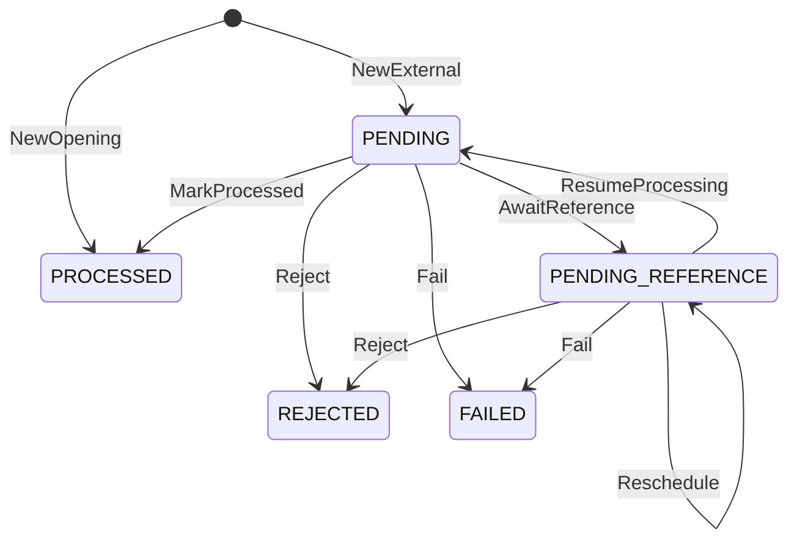

# Arquitetura

## Money

Valores monetários são `int64` em minor units (centavos) mais um código ISO 4217. Só moedas
com duas casas decimais são aceitas: BRL, USD e EUR. O intervalo vai até
±92.233.720.368.547.758,07, muito além de qualquer wallet. Nenhum caminho usa `float`.

Contrato externo:
- O `amount` é sempre uma string JSON no formato `^(0|[1-9]\d*)\.\d{2}$`, e a `currency`
  é o código em maiúsculas: `{"amount":"25.00","currency":"BRL"}`.
- Os valores abaixo são rejeitados, nunca arredondados:
  - `25.00` como número JSON;
  - `"25"`, `"1.5"`, `"01.00"`, `"+1.00"` e `"1e2"`;
  - espaços;
  - valores negativos.
- Como o formato é estrito, cada valor tem uma única representação textual, e o hash do
  payload não precisa normalizar amounts.

Internamente:
- O parse acumula dígito a dígito com checagem de overflow. `strconv.ParseFloat` nunca é
  usado.
- `ParseSigned` aceita um `-` inicial para valores internos (por exemplo, a soma do ledger
  na reconciliação) e rejeita `-0.00`.
- `Add`, `Sub` e `Neg` retornam `ErrOverflow` em vez de dar a volta. Operações entre moedas
  diferentes retornam `ErrCurrencyMismatch`.
- O zero value de `Money` é inválido: todo método retorna `ErrUninitialized`, então um valor
  esquecido nunca vira `0.00` em silêncio.
- Erros de parse são `*ParseError{Input, Reason}`. O `Reason` é um dos sentinels
  (`ErrInvalidAmount`, `ErrInvalidCurrency`, `ErrOverflow`, `ErrInvalidJSON`) e funciona com
  `errors.Is` e `errors.As`.

## Acesso ao banco e mapeamento de Money

- Driver: pgx v5 com `pgxpool`. As queries são SQL escrito à mão, com parâmetros
  posicionais (`$1`), e o sqlc (v1.31.1) as compila em funções Go tipadas, validando cada
  query contra o schema das migrations. Não há ORM.
- O código gerado fica versionado em `internal/adapters/postgres/database`. O CI roda
  `sqlc diff` e falha se ele divergir das queries.
- Migrations com goose, em SQL, embutidas no binário `migrate` (`up`, `down`, `status`,
  `reset`). Toda migration tem `Down`, e os grants do papel da aplicação vivem nas próprias
  migrations.
- `Money` vira duas colunas: `*_minor BIGINT` com as unidades mínimas e `currency CHAR(3)`.
  O valor é gravado e lido exatamente como o `int64` do domínio, sem `NUMERIC` nem `float`.
- Dois papéis no Postgres:
  - `wallet_migrator` é dono do banco e do schema e roda as migrations;
  - `wallet_app` só tem `SELECT`/`INSERT`/`UPDATE` nas tabelas de que precisa, e não pode
    alterar schema, desligar triggers nem apagar linhas.

## Invariantes no banco

As invariantes financeiras valem mesmo que o código da aplicação erre. Cada uma tem um nome
de constraint estável, que a aplicação usa para classificar o erro.

- Saldo nunca negativo: `CHECK (balance_minor >= 0)` na carteira e nos saldos do ledger.
- Todo saldo alterado tem lançamento:
  - uma constraint trigger adiada (`wallets_ledger_coupling`) roda no commit. Se o saldo
    mudou, exige `version = anterior + 1` e um lançamento com
    `(wallet_id, wallet_version, saldo anterior, saldo posterior)` iguais;
  - se o saldo não mudou, a versão também não pode mudar;
  - uma segunda trigger (`ledger_entries_wallet_coupling`) impede lançamento à frente da
    versão da carteira;
  - com `UNIQUE (wallet_id, wallet_version)`, lançamentos e mudanças de saldo ficam em
    correspondência um para um.
- Lançamento coerente:
  - aritmética `after = before ± amount` por direção;
  - `amount > 0`, então `LOSS` nunca gera lançamento;
  - chaves estrangeiras compostas obrigam o lançamento a ter a moeda da carteira e a
    carteira, a moeda e o valor da sua transação.
- Ledger append-only: `UPDATE`, `DELETE` e `TRUNCATE` são revogados do papel da aplicação,
  e triggers os recusam até para o dono da tabela.
- Sem movimentação duplicada:
  - `UNIQUE (wallet_id, transaction_id)` no ledger;
  - `UNIQUE (provider_id, idempotency_key)` e `UNIQUE (provider_id,
    external_transaction_id)` nas transações;
  - no máximo um `OPENING` por carteira;
  - no máximo uma reversão processada por transação referenciada.
- Transação terminal congelada: uma trigger recusa qualquer alteração depois de `PROCESSED`,
  `REJECTED` ou `FAILED`. Identidade, valor, hash e referência externa são imutáveis em
  qualquer estado, e a referência resolvida só pode ser gravada uma vez.
- `PENDING` nunca é gravado: o `CHECK` de status só aceita `PENDING_REFERENCE` e os estados
  terminais.
- Origem: `INTERNAL` se e somente se `OPENING`, sem nenhum metadado externo. Operações
  externas exigem provider existente, ids e chave no formato do contrato e hash SHA-256 em
  hex.
- Outbox: o envelope gravado (id, tipo, versão, agregado, payload, horários) é imutável; só
  as colunas de entrega mudam.
- Carteira: id, jogador, moeda e criação são imutáveis, e carteiras não são apagadas.

## Fronteira da transação

- Os casos de uso são donos da transação, e os repositórios nunca abrem uma.
  `TxRunner.InTx(ctx, fn)` abre a transação em `READ COMMITTED` e chama `fn` com um `Store`.
  Os repositórios do `Store` (`Wallets`, `Transactions`, `Ledger`, `Outbox`, `Inbox`) usam
  todos a mesma `pgx.Tx`. Se `fn` retornar `nil`, o runner faz o commit; qualquer erro faz
  rollback.
- O `Store` é o único acesso ao banco dentro da transação. Por isso "tudo no mesmo commit"
  aparece na própria chamada: carteira, transação, lançamento, outbox e inbox.
- Toda transação define `lock_timeout` e `statement_timeout` com `SET LOCAL`, no mesmo round
  trip do `BEGIN`. Nada vaza para o próximo uso da conexão.
  `idle_in_transaction_session_timeout` fica configurado no papel `wallet_app`.
- `InTx` repete a transação inteira, com limite e backoff exponencial com jitter, em dois
  casos:
  - serialization failure, deadlock e lock timeout;
  - `23505` nos índices de chave de idempotência, id externo e reversão. Isso é uma corrida
    perdida, e a nova execução encontra a vencedora.

  Por isso `fn` precisa poder rodar de novo: ela relê tudo pelo `Store`.
- Erros de conexão não são repetidos dentro de `InTx`, porque um `COMMIT` perdido tem
  resultado desconhecido. Quem chamou tenta de novo (HTTP 503, visibilidade do SQS, próximo
  ciclo do resolver), e a idempotência absorve a repetição.
- `InReadOnlySnapshot` usa `REPEATABLE READ READ ONLY`. Todas as leituras da reconciliação
  veem o mesmo instante, e qualquer escrita é recusada.
- Os repositórios recebem e devolvem agregados do domínio. Gravam `Snapshot()` e leem com
  `Rehydrate`. Uma linha que não passa na validação do domínio é tratada como estado
  corrompido, uma falha permanente.
- Nenhuma query usa `now()`: todo horário vem do relógio da aplicação, como no domínio.

## Idempotência

HTTP e SQS montam o mesmo comando. O corpo do `POST /wagering/transactions` e o `data` da
mensagem `WagerTransactionRequested` são o mesmo contrato; o SQS só acrescenta
`idempotencyKey`, que no HTTP vem do header `Idempotency-Key`. O servidor nunca troca a chave
recebida por uma calculada.

Hash do payload:
- SHA-256, em hex minúsculo, do JSON canônico dos campos de negócio: `providerId`,
  `externalTransactionId`, `playerId`, `walletId`, `roundId`, `gameId`, `kind`,
  `money{amount,currency}` e, só quando presente, `referenceExternalTransactionId`.
- Ficam de fora a chave de idempotência, o `messageId`, o `occurredAt`, o tipo do envelope,
  headers e claims do token. Por isso a mesma operação tem o mesmo hash nos dois canais, e um
  teste compara o corpo HTTP e a mensagem SQS do enunciado.
- JSON canônico: chaves em ordem lexicográfica de bytes, sem espaços, sem escape de HTML e sem
  quebra de linha no final.
- A única normalização é renderizar os UUIDs no formato canônico em minúsculas. Os demais
  formatos são estritos e não têm duas grafias para o mesmo valor:
  - valor com exatamente duas casas decimais;
  - moeda e `kind` em maiúsculas;
  - identificadores em ASCII visível.

Formato dos campos, validado antes das regras de negócio:
- Identificadores (`providerId`, `externalTransactionId`, `roundId`, `gameId`,
  `referenceExternalTransactionId`), a chave de idempotência e o correlation id têm de 1 a
  128 caracteres ASCII visíveis (0x21–0x7E). Espaço não é aceito: o HTTP remove espaços das
  pontas de um header e o SQS não, então a mesma chave poderia chegar diferente por canal.
- UUIDs só no formato de 36 caracteres com hífens, em maiúsculas ou minúsculas. O UUID nulo é
  rejeitado.
- Todos os erros de formato voltam juntos, um por campo. Só depois vêm as regras do domínio:
  `OPENING` proibido, política de valor zero e presença da referência.

Decisão ao receber uma operação, já com o lock da carteira:

| Situação | Resultado |
|---|---|
| Mesma chave, mesmo hash | Replay: o resultado gravado, com `idempotentReplay: true` |
| Mesma chave, hash diferente | Conflito `IDEMPOTENCY_KEY_REUSED`, nada é gravado |
| Mesmo `externalTransactionId` com outra chave | Conflito `EXTERNAL_TRANSACTION_ID_CONFLICT`, nada é gravado |
| Nenhuma das anteriores | Operação nova: regras, persistência e eventos |

- A chave e o id externo são únicos por provider. O mesmo `externalTransactionId` em outro
  provider é outra operação.
- O replay devolve o estado gravado, inclusive o saldo observado no processamento original,
  mesmo que a carteira já tenha se movido. Também vale para rejeições e para
  `PENDING_REFERENCE`.
- A consulta acontece depois do lock da carteira. Assim, requisições concorrentes com a mesma
  chave se enfileiram, e a segunda já vê a primeira confirmada. Quando a carteira não existe
  não há lock, e a corrida termina num `23505`. A nova execução de `InTx` encontra a
  vencedora e responde com replay ou conflito.

## Locking e concorrência

- Lock pessimista por carteira: toda operação começa com `SELECT … FOR UPDATE` na carteira e
  o segura por alguns milissegundos, até o commit.
- Carteiras diferentes não disputam nada. Não há lock global, e cada instância processa em
  paralelo.
- Deadlock é estruturalmente impossível: cada transação trava no máximo uma carteira, sempre
  na ordem carteira → linhas de transação.
- Duas barreiras continuam atrás do lock:
  - o `UPDATE` condicionado à versão esperada, que falha com `ErrConcurrentUpdate` e é
    repetido;
  - a trigger adiada que exige o lançamento correspondente no commit.
- Um lock que não sai em `lock_timeout` vira falha transitória (`55P03`). `InTx` tenta de
  novo algumas vezes antes de devolver o erro.
- Ao terminar (`PROCESSED` ou `REJECTED`), a operação acorda as dependentes da mesma
  carteira: transações em `PENDING_REFERENCE` que apontam para o seu
  `externalTransactionId` passam a ter `next_attempt_at = agora`. Assim o resolver não
  espera o backoff inteiro.

## Reconciliação

- `POST /wallets/{id}/reconciliation` reconstrói o saldo a partir do ledger numa transação
  `REPEATABLE READ READ ONLY`: carteira e lançamentos são lidos no mesmo instante, e nada é
  escrito.
- A soma dos lançamentos com sinal (crédito positivo, débito negativo) é feita em `NUMERIC`.
  Ela volta como texto e passa por `money.ParseSigned`, então uma soma fora do intervalo de
  `int64` vira erro em vez de dar a volta.
- A versão também é conferida: os lançamentos têm de formar uma sequência contínua que
  termina na versão da carteira. A sequência começa na versão 1 (abertura com saldo) ou 2
  (abertura com zero). Sem lançamentos, a carteira tem de estar na versão 1.
- `difference = storedBalance − calculatedBalance`. O resultado só é `consistent` quando a
  diferença é zero e as versões são contínuas.
- Uma divergência é registrada em log `WARN`, com os saldos, a diferença e as versões, e
  incrementa uma métrica.

## Máquina de estados

- `PENDING` só existe em memória. Uma operação síncrona vai de `PENDING` para `PROCESSED`,
  `REJECTED` ou `PENDING_REFERENCE` dentro de uma única transação SQL, e `Rehydrate` recusa
  um snapshot em `PENDING`.
- `PENDING_REFERENCE` é o único estado não terminal gravado no banco. O resolver de qualquer
  instância o retoma.
- `PROCESSED`, `REJECTED` e `FAILED` são terminais: toda transição a partir deles retorna
  `ErrTerminalState`. Uma transição fora do diagrama retorna `ErrInvalidTransition`.
- O replay lê o resultado persistido e nunca chama as regras de novo.
- `Rehydrate` valida o snapshot sem reaplicar transições, lançamentos ou eventos.
- Todas as regras de negócio ficam em `wager.Rules.Apply`. HTTP, SQS e o resolver chamam essa
  mesma função.

## Falhas transitórias vs permanentes

O adapter do Postgres classifica todo erro em um de quatro tipos, com `errors.Is` sobre
sentinels de `app` e do domínio. O erro original continua acessível por `errors.As`.

- Transitórias (`app.ErrTransient`): contexto cancelado ou expirado, e qualquer falha para
  alcançar o servidor (conexão recusada ou perdida, inclusive falha de autenticação ao
  conectar). Também os SQLSTATE `08*`, `53*`, `57P0*`, `57014` (statement timeout), `25P03`,
  `40001`, `40P01` e `55P03`, além de 5xx ou throttling do SQS. São repetidas e nunca
  persistidas.
- Conflito repetível (`app.ErrRetryableConflict`): `23505` nos índices de chave de
  idempotência, id externo e reversão, ou um `UPDATE` condicional que não encontrou a linha
  na versão ou no estado esperado. `InTx` repete a transação na hora.
- Erro de domínio: `23505` em `wallets_player_currency_key` vira `WALLET_ALREADY_EXISTS`, e
  a resposta traz o id da carteira existente.
- Permanentes (`app.ErrPermanent`): qualquer outra violação de integridade (`CHECK`, FK,
  triggers), estado gravado corrompido (um `Rehydrate` que falha) ou retries transitórios
  esgotados no resolver. A transação vai para `FAILED` com `PROCESSING_FAILED`, para
  auditoria.
- Rejeição de negócio não é falha: a transação termina em `REJECTED` com um `failureCode`.

## Referências pendentes

- A referência é resolvida por `(providerId, referenceExternalTransactionId)`. `REFUND` e
  `ROLLBACK` exigem uma; `WIN` pode informar uma `BET`.
- Referência ausente, ou presente mas ainda não terminal, deixa a transação em
  `PENDING_REFERENCE`. A primeira espera grava o deadline (`agora + TTL`) e emite
  `WagerTransactionPendingReference`. As tentativas seguintes só reagendam, sem evento.
- `attempts` conta toda busca que não encontrou uma referência utilizável, inclusive a
  síncrona. O próximo instante é `agora + backoff(attempts)`, limitado ao deadline.
- Quando `attempts` chega ao máximo ou o deadline passa, a transação vira `REJECTED`, com
  `REFERENCE_NOT_FOUND` se a referência nunca apareceu, ou `REFERENCE_NOT_SETTLED` se ela
  existe mas não terminou. O evento `WagerTransactionRejected` é emitido.
- Uma referência que terminou sem sucesso (`REJECTED` ou `FAILED`) rejeita a transação na
  hora, com `REFERENCE_NOT_PROCESSED`.
- Tipo, provider, jogador, carteira, rodada, moeda e valor da referência nunca mudam, então
  são checados antes do status. Uma referência que nunca vai servir é rejeitada na hora, sem
  esperar o TTL.

Resolver:
- Toda instância roda um resolver (componente `resolver`), sem eleição de líder.
- A cada `RESOLVER_POLL_INTERVAL` (1 s), ele lê sem lock os ids vencidos
  (`next_attempt_at <= agora`, até `RESOLVER_BATCH_SIZE`).
- Cada id é tratado na sua própria transação:
  1. trava a carteira e depois a transação, na mesma ordem do caminho síncrono, o que
     impede deadlock;
  2. confere de novo se a transação ainda está pendente e vencida (senão, pula);
  3. chama as mesmas regras do envio.
- O resultado sai direto das regras do domínio:
  - referência processada: a operação é aplicada;
  - referência ausente ou pendente: reagenda com backoff;
  - TTL ou tentativas esgotadas: `REJECTED`;
  - referência rejeitada ou falha: `REFERENCE_NOT_PROCESSED`.
- Vários resolvers disputam os mesmos ids sem problema. O segundo espera o lock da carteira,
  encontra a transação já resolvida e pula. Cada transação é aplicada uma vez.
- Um resolver interrompido no meio de uma transação faz rollback. O id continua pendente e
  qualquer instância o retoma no próximo ciclo.
- Toda operação que termina (`PROCESSED` ou `REJECTED`) acorda as dependentes da mesma
  carteira, seja no envio ou no resolver. Cadeias como rollback → refund → bet se resolvem
  sem esperar o backoff.
- Um erro permanente repetido (`RESOLVER_MAX_FAILURES` vezes seguidas, 3 por padrão) no
  mesmo id grava `FAILED` com `PROCESSING_FAILED`.
  - A gravação não depende de reidratar a linha, então funciona mesmo com estado corrompido.
  - Erro transitório nunca leva a `FAILED`. O TTL encerra a transação quando o banco
    voltar.
  - `FAILED` não gera evento: é um estado de auditoria, consultável por GET.
- Métrica: `wallet_resolver_outcomes_total{outcome}` (processed, rejected, rescheduled,
  skipped, failed, error).

## Política de reversão

- Cada transação referenciada recebe no máximo uma reversão processada, de qualquer tipo.
  Uma `BET` é reembolsada **ou** desfeita, nunca as duas coisas.
- Um `REFUND` pode ser desfeito uma vez (`ROLLBACK` do `REFUND`). Depois disso a `BET` não
  pode ser reembolsada de novo, porque já tem uma reversão processada. Assim o mesmo débito
  nunca é devolvido duas vezes.
- `REFUND` só referencia `BET`. `ROLLBACK` referencia `BET`, `WIN` ou `REFUND`; `ROLLBACK`
  de `ROLLBACK`, `LOSS` ou `OPENING` retorna `REFERENCE_KIND_NOT_REVERSIBLE`.
- O valor da reversão é igual ao da referência, porque reversões parciais estão fora do
  escopo. Um valor diferente retorna `REFERENCE_AMOUNT_MISMATCH`.
- Um `ROLLBACK` que precisaria debitar mais que o saldo é rejeitado com
  `REVERSAL_INSUFFICIENT_FUNDS`, diferente do `INSUFFICIENT_FUNDS` de uma aposta.
- O domínio recebe a informação "já revertida" junto com a referência. Um índice único
  parcial no banco garante a mesma regra.

## Códigos de falha

"Corrigível" quer dizer que a requisição estava errada: o provider pode corrigi-la e reenviar
com um novo `externalTransactionId` e uma nova chave, já que a transação rejeitada é
terminal. "Definitivo" quer dizer que a requisição era coerente e a resposta é não.

| Código | Quando | Tipo |
|---|---|---|
| `WALLET_NOT_FOUND` | A carteira não existe | Corrigível |
| `WALLET_PLAYER_MISMATCH` | A carteira é de outro jogador | Corrigível |
| `CURRENCY_MISMATCH` | A moeda difere da moeda da carteira | Corrigível |
| `REFERENCE_NOT_FOUND` | A referência não apareceu até o TTL ou o limite de tentativas | Corrigível |
| `REFERENCE_MISMATCH` | A referência difere em provider, jogador, carteira, rodada ou moeda, ou o `WIN` não referencia uma `BET` | Corrigível |
| `REFERENCE_KIND_NOT_REVERSIBLE` | O tipo da referência não pode ser revertido por esta operação | Corrigível |
| `REFERENCE_AMOUNT_MISMATCH` | O valor da reversão difere do valor referenciado | Corrigível |
| `INSUFFICIENT_FUNDS` | A `BET` excede o saldo | Definitivo |
| `REVERSAL_INSUFFICIENT_FUNDS` | O `ROLLBACK` debitaria mais que o saldo | Definitivo |
| `REFERENCE_NOT_SETTLED` | A referência existe, mas não terminou até o TTL ou o limite de tentativas | Definitivo |
| `REFERENCE_NOT_PROCESSED` | A referência terminou em `REJECTED` ou `FAILED` | Definitivo |
| `ALREADY_REVERSED` | A referência já tem uma reversão processada | Definitivo |
| `BALANCE_OVERFLOW` | O crédito passaria do maior saldo representável | Definitivo |
| `PROCESSING_FAILED` | Falha permanente de infraestrutura (estado `FAILED`) | Definitivo |

Quando mais de uma regra falha, vale a primeira nesta ordem: carteira (existência, jogador,
moeda), referência (tipo, identidade, valor, status, reversão anterior) e, por último, o
efeito no saldo. As rejeições de carteira não devolvem saldo, para não expor o saldo de
outro jogador. As demais guardam o saldo observado na rejeição, e o replay o devolve.

## Inbox e outbox

## Contratos SQS

## Contratos e roteamento de eventos

Envelope de todo evento:

| Campo | Conteúdo |
|---|---|
| `eventId` | UUIDv5 de `(transactionId, eventType)` |
| `eventType` | `WagerTransactionProcessed`, `WagerTransactionRejected`, `WagerTransactionPendingReference` ou `WalletBalanceChanged` |
| `aggregateId` | `transactionId` nos eventos de transação; `walletId` em `WalletBalanceChanged` |
| `correlationId` | O da requisição que criou a transação |
| `causationId` | Só em `WalletBalanceChanged`: o `transactionId` que moveu o saldo |
| `occurredAt` | UTC, RFC 3339 |
| `version` | `1` em todos os tipos, definido pelo construtor |
| `data` | Payload tipado do evento |

- Cada transação emite cada tipo de evento no máximo uma vez, então o `eventId` é
  determinístico. Uma republicação carrega o mesmo `eventId`, e a chave primária da outbox
  impede que o mesmo evento seja gravado duas vezes.
- Valores monetários seguem o contrato de `Money`: `{"amount":"25.00","currency":"BRL"}`.
- Os eventos de `OPENING` têm `origin: "INTERNAL"` e omitem provider, ids externos, rodada e
  jogo.
- `WalletBalanceChanged` traz `walletId`, `transactionId`, `direction`, `money`,
  `balanceBefore`, `balanceAfter` e `walletVersion`. Consumidores ordenam por
  `walletVersion`.
- A chave de partição de todo evento é o `walletId`.

## Identity provider e validação de token

O IdP é o Keycloak (26.7.4, no compose), com o realm `wagering` importado de
`deploy/keycloak/realm-wagering.json`. Ele é o IdP recomendado pelo desafio, roda localmente
sem conta externa e emite JWTs RS256 com `client_credentials`, o fluxo de serviço para
serviço. O serviço não guarda senhas nem emite tokens.

- Cada integração é um client confidencial que só pode usar service account:
  - `provider-a` e `provider-b` têm o papel `wager-provider` e uma claim fixa
    `provider_id`, igual ao id do client;
  - `wallet-backoffice` tem o papel `wallet-operator`;
  - os três recebem a audiência `wagering-api` por um mapper.
- Os segredos dos clients ficam só no `.env` (`PROVIDER_A_SECRET`, …), como as senhas do
  banco. O arquivo do realm usa placeholders `${VAR}`, que o Keycloak resolve na importação,
  e o compose repassa as variáveis. `.env.example` traz valores de desenvolvimento local.
  `scripts/get-token.sh <client>` devolve um access token.
- Validação local, sem chamar o Keycloak por requisição:
  - As chaves públicas vêm do JWKS do realm e ficam em cache. Um `kid` desconhecido força
    uma nova busca, o que cobre a rotação de chaves.
  - Só RS256 é aceito: `none`, HMAC e outros algoritmos são recusados antes de olhar as
    claims.
  - `iss` tem de ser exatamente o issuer configurado, `aud` tem de conter `wagering-api`, e
    `exp` precisa estar no futuro (sem tolerância).
  - `typ` tem de ser `Bearer`, o que recusa ID token e refresh token. `sub` e `azp` são
    obrigatórios.
- O issuer é fixado por `KC_HOSTNAME=http://localhost:8080`. Assim o `iss` é o mesmo para
  quem pede o token pelo host e para os containers, que buscam as chaves em
  `http://keycloak:8080/...` (`OIDC_JWKS_URL`).
- O Keycloak não é dependência de inicialização. Se o JWKS estiver inacessível quando a chave
  ainda não está em cache, a resposta é 503 `TEMPORARILY_UNAVAILABLE`, não 401: o token pode
  estar certo, e quem está fora é o IdP.
- Trade-off da validação local: sem introspecção, o caminho quente não depende do Keycloak.
  Em troca, um token revogado continua válido até o `exp`, então os tokens duram pouco
  (5 min).

Respostas de autenticação (`application/problem+json`):

| Situação | Status | Detalhe |
|---|---|---|
| Sem `Authorization: Bearer …` | 401 | `WWW-Authenticate: Bearer realm="wagering"`, `code: UNAUTHENTICATED` |
| Token inválido, expirado, de outro issuer ou audiência, assinatura errada | 401 | igual, mais `error="invalid_token"` |
| Chaves do IdP inacessíveis | 503 | `Retry-After`, `code: TEMPORARILY_UNAVAILABLE`, `retryable: true` |
| Token válido sem permissão para a operação | 403 | `code: FORBIDDEN` (fase 9) |

## Modelo de permissões

A identidade vem só do token. O `providerId` do corpo ou do path é comparado com a claim
`provider_id`, e nunca vale sozinho.

| Operação | Quem pode | Caso contrário |
|---|---|---|
| `POST /wagering/transactions` | `wager-provider` cujo `provider_id` é o `providerId` do corpo | 403, antes de qualquer acesso ao banco |
| `GET /providers/{providerId}/wagering/transactions/{id}` | o próprio provider, ou `wallet-operator` | 403 |
| `GET /wagering/transactions/{id}` | `wallet-operator`, ou o provider dono da transação | 404 idêntico ao de inexistente, para não revelar que a transação existe |
| Carteiras: abrir, ler, ledger, reconciliação | `wallet-operator` | 403 |

- Um provider nunca vê transações de outro, nem por replay. A chave de idempotência e o id
  externo valem dentro do provider do token, então repetir a chave de outro provider cria
  uma operação separada em vez de devolver a dele.
- Uma claim `provider_id` sem o papel `wager-provider` não dá acesso a nada.
- Transações `OPENING` não têm provider e só são visíveis para `wallet-operator`.
- `/health/*` é público. Qualquer outro caminho exige token, inclusive os que não existem:
  sem token a resposta é 401, e só com token um caminho desconhecido vira 404. Assim a
  estrutura das rotas não vaza.
- As decisões são funções puras em `internal/auth`, testadas isoladamente e com tokens reais
  do Keycloak.

## Contrato HTTP

Rotas: `POST /wallets`, `GET /wallets/{walletId}`, `GET /wallets/{walletId}/ledger`,
`POST /wallets/{walletId}/reconciliation`, `POST /wagering/transactions`,
`GET /wagering/transactions/{transactionId}` e
`GET /providers/{providerId}/wagering/transactions/{externalTransactionId}`.

Resultados de `POST /wagering/transactions`. O status vem do estado gravado, seja operação
nova ou replay:

| Situação | Status | Corpo |
|---|---|---|
| Processada (nova ou replay) | 200 | resultado, `idempotentReplay` false/true |
| Referência pendente | 202 + `Location` | resultado com `status: PENDING_REFERENCE` e `referenceDeadlineAt` |
| Rejeição de negócio | 422 | resultado com `status: REJECTED`, `failureCode` e o saldo observado |
| Falha permanente registrada | 500 | resultado com `status: FAILED` e `failureCode: PROCESSING_FAILED` |

O resultado é `{transactionId, externalTransactionId, status, failureCode?, balance?,
walletVersion?, referenceDeadlineAt?, idempotentReplay}`.

Os demais casos respondem `application/problem+json`:

| Situação | Status | `code` |
|---|---|---|
| Campo inválido | 400 | `INVALID_REQUEST`, com um item em `errors[]` por campo |
| `Idempotency-Key` ausente | 400 | `IDEMPOTENCY_KEY_REQUIRED` |
| Sem token ou token inválido | 401 | `UNAUTHENTICATED` |
| Sem permissão | 403 | `FORBIDDEN` |
| Carteira ou transação inexistente (ou de outro provider) | 404 | `WALLET_NOT_FOUND` / `TRANSACTION_NOT_FOUND` |
| Chave reutilizada com outro conteúdo | 409 | `IDEMPOTENCY_KEY_REUSED` |
| `externalTransactionId` já usado com outra chave | 409 | `EXTERNAL_TRANSACTION_ID_CONFLICT` |
| Jogador já tem carteira na moeda | 409 | `WALLET_ALREADY_EXISTS`, com `Location` da carteira existente |
| Corpo acima de 64 KiB | 413 | `PAYLOAD_TOO_LARGE` |
| `Content-Type` diferente de JSON | 415 | `UNSUPPORTED_MEDIA_TYPE` |
| Indisponibilidade transitória (banco fora, lock timeout, pool esgotado, prazo de 10 s) | 503 + `Retry-After` | `TEMPORARILY_UNAVAILABLE` |
| Erro interno | 500 | `INTERNAL_ERROR`, sem detalhes internos |

- Todo problem traz `type`, `title`, `status`, `code`, `category`, `retryable` e `errors[]`
  (sempre presente, `{field, code}`). `retryable` é verdadeiro só para 503.
- Entrada:
  - JSON estrito: campos desconhecidos (`UNKNOWN_FIELD`), tipos errados (por exemplo
    `amount` como número), corpo vazio e qualquer coisa depois do objeto são recusados com
    400;
  - `limit` do ledger é um inteiro de 1 a 200, e sem ele o padrão é 50;
  - o cursor é opaco.
- `X-Correlation-Id`: um valor válido (1 a 128 caracteres ASCII visíveis) é mantido, e sem
  ele o servidor gera um UUIDv7. O id volta na resposta, fica gravado na transação e aparece
  em todos os logs da requisição.
- Timeouts do servidor: leitura de headers 5 s, leitura 10 s, escrita 15 s, conexão ociosa
  60 s. Cada requisição tem prazo de 10 s.

## Controle de acesso ao broker

`deploy/aws/provision.sh` cria as filas e um usuário IAM por papel, cada um com uma policy
restrita às filas de que precisa:

| Usuário | Permissões |
|---|---|
| `provider-producer` | `SendMessage` em `wager-transactions.fifo` |
| `wallet-service` | Receber, apagar e mudar visibilidade em `wager-transactions.fifo`; enviar para `wager-transactions-dlq.fifo` e `wallet-events.fifo` |
| `events-reader` | Receber, apagar e mudar visibilidade em `wallet-events.fifo` |

Todas as filas são FIFO, com `ContentBasedDeduplication=false` e `VisibilityTimeout=30`:
- `wager-transactions.fifo` faz long polling de 20 s e manda a mensagem para
  `wager-transactions-dlq.fifo` depois de 10 recebimentos;
- `wallet-events.fifo` usa a mesma regra de 10 recebimentos, com `wallet-events-dlq.fifo`;
- as DLQs guardam mensagens por 14 dias.

O script é idempotente e pode rodar de novo a qualquer momento.

## Emulador AWS local

SQS e IAM locais rodam no [MiniStack](https://github.com/ministackorg/ministack), fixado em
`ministackorg/ministack:1.5.17`. Ele é gratuito e sobe a partir de um clone limpo, sem conta
nem token.

Três candidatos foram testados com a AWS CLI em 2026-09-26:

| | LocalStack 2026.8.4 | LocalStack 4.14.0 | MiniStack 1.5.17 |
|---|---|---|---|
| Sobe sem conta ou auth token | Não, sai com código 55 (license activation failed) | Sim | Sim |
| Filas FIFO, `MessageDeduplicationId`, redrive para DLQ FIFO | Não testável sem token | Sim | Sim |
| Policies IAM aplicadas | Recurso pago | Não, `ENFORCE_IAM=1` é ignorado | Não |
| `SenderId` distingue credenciais | Não testável sem token | Não, `000000000000` para toda chave | Não, `000000000000` para toda chave |

O LocalStack 4.14.0 é a última imagem que roda sem token. O repositório da edição community
foi arquivado em 2026-03-23, então ele não recebe mais correções. O MiniStack tem licença MIT
e continua recebendo releases.

Nos dois candidatos que subiram, os comportamentos do SQS dos quais o consumer depende
bateram com a AWS:
- Um envio sem deduplication id é rejeitado quando `ContentBasedDeduplication=false`.
- Um deduplication id repetido devolve o `MessageId` original e a mensagem é entregue uma
  única vez.
- Enquanto um message group tem uma mensagem in flight, nenhuma outra mensagem desse grupo é
  entregue.
- `ChangeMessageVisibility=0` libera a mensagem na hora e incrementa `ApproximateReceiveCount`.
- Depois de `maxReceiveCount` recebimentos, a mensagem vai para a DLQ FIFO.

## Módulos Fx e sequência de shutdown

O domínio e os casos de uso não conhecem Fx. A composição fica em `internal/bootstrap`, e cada
adapter ou componente de plataforma expõe um `fx.Module`. Os construtores são puros: nenhum
abre conexão nem inicia goroutine. Cada módulo registra os seus hooks num único `fx.Invoke`.

| Módulo | Fornece | Hooks |
|---|---|---|
| `logging` | `*slog.Logger` JSON, com os atributos do contexto | — |
| `health` | `*health.Checker`, que agrega os checks do grupo `health.checks` | — |
| `postgres` | `*pgxpool.Pool`, `app.TxRunner`, check `postgres` | start: ping com retry; stop: fecha o pool |
| `sqs` | cliente SQS, check `sqs` | start: resolve as URLs das filas com retry; stop: fecha conexões ociosas |
| `metrics` | registry Prometheus, `app.Metrics`, servidor admin | start/stop do servidor admin (`/metrics`, `/health/*`) |
| `app` | `WalletService`, `WagerService`, regras, relógio, ids | — |
| `httpapi` | servidor HTTP público | start/stop, só com o componente `http` ativo |

Sequência:
- O `main` carrega a configuração antes do Fx. Qualquer valor inválido encerra o processo
  com todos os problemas listados.
- **Start:** dependências → servidores → workers, na ordem dos módulos.
  - O pool só é considerado pronto depois de um ping bem-sucedido, e as filas depois de
    resolvidas. As duas coisas são tentadas de novo até `START_TIMEOUT`.
  - O servidor faz `net.Listen` dentro do hook, então porta ocupada falha a inicialização.
- **Stop:** ordem inversa, dentro de `SHUTDOWN_TIMEOUT`.
  1. O primeiro passo é o drain: a readiness passa a responder 503.
  2. Os workers (fases 10–12) cancelam o contexto e esperam as goroutines.
  3. Os servidores fazem `Shutdown` e terminam as requisições em andamento.
  4. O SQS fecha as conexões ociosas.
  5. Por último, o pool fecha, depois de tudo que o usa.
- `COMPONENTS=http,consumer,outbox,resolver` escolhe o que a instância executa. Os módulos
  ficam sempre no grafo, e um componente desligado só não registra os seus hooks. Com isso
  a validação do grafo (`fx.ValidateApp`) cobre tudo em qualquer combinação.
- `SHUTDOWN_TIMEOUT` (20 s) tem de ser menor que a visibilidade do SQS (30 s), e a
  configuração recusa o contrário. No compose, `stop_grace_period` é 30 s, maior que o
  timeout.

## Observabilidade

- Logs JSON em stderr, com `instanceId` em toda linha.
  - `correlationId`, `messageId`, `transactionId`, `walletId` e `providerId` entram no
    contexto com `logging.With` e aparecem em todo log que recebe esse contexto.
  - Chaves com `authorization`, `password`, `secret`, `token` ou `cookie` são mascaradas, e
    a URL do banco aparece sem a senha.
  - Payloads financeiros completos não são logados.
- Métricas Prometheus em `ADMIN_ADDR` (`/metrics`), num registry próprio:
  - runtime Go e processo;
  - `wallet_http_requests_total{method,route,status}` e
    `wallet_http_request_duration_seconds{method,route}`. `route` é o padrão da rota
    (`GET /wallets/{walletId}`), não a URL, então a cardinalidade fica limitada;
  - `wallet_reconciliation_divergences_total`.

  As métricas de consumer, outbox e resolver entram nas fases correspondentes.
- Health checks:
  - `/health/live` responde 200 enquanto o processo está de pé;
  - `/health/ready` testa PostgreSQL (`ping`) e SQS (`GetQueueAttributes` na fila de
    entrada), 2 s cada, em paralelo. A resposta pública diz só `ok`/`unavailable` por
    check, e o erro vai para o log;
  - durante o drain a readiness responde 503 sem testar nada;
  - os dois endpoints existem na porta pública e na admin. O healthcheck do container
    (`wallet healthcheck`) usa a admin, que existe mesmo com o componente `http` desligado.

## Limitações, interpretações e trabalho pendente

- O IAM não é aplicado localmente. Os usuários e policies por papel continuam sendo
  provisionados, e só são aplicados na AWS real.
- Localmente, o `SenderId` é o account id para qualquer credencial, então o consumer não o usa
  para identificar o provider. O provider do envelope é validado contra o banco.
- `BET` e `LOSS` não aceitam `referenceExternalTransactionId`, e nenhuma operação pode
  referenciar a si mesma. As duas situações são entrada inválida.
- A referência de um `WIN` é opcional e não tem regra de valor: um prêmio não precisa ser
  igual à aposta.
- Um token com `kid` desconhecido força uma busca no JWKS. A biblioteca junta buscas
  simultâneas, mas não limita a frequência. Um limite por intervalo fica como trabalho
  pendente.
- Tokens revogados continuam aceitos até expirar (validação local, sem introspecção).
